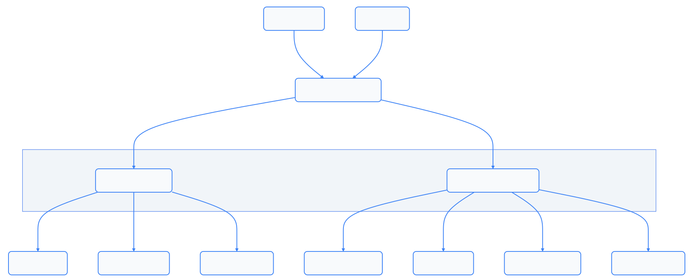
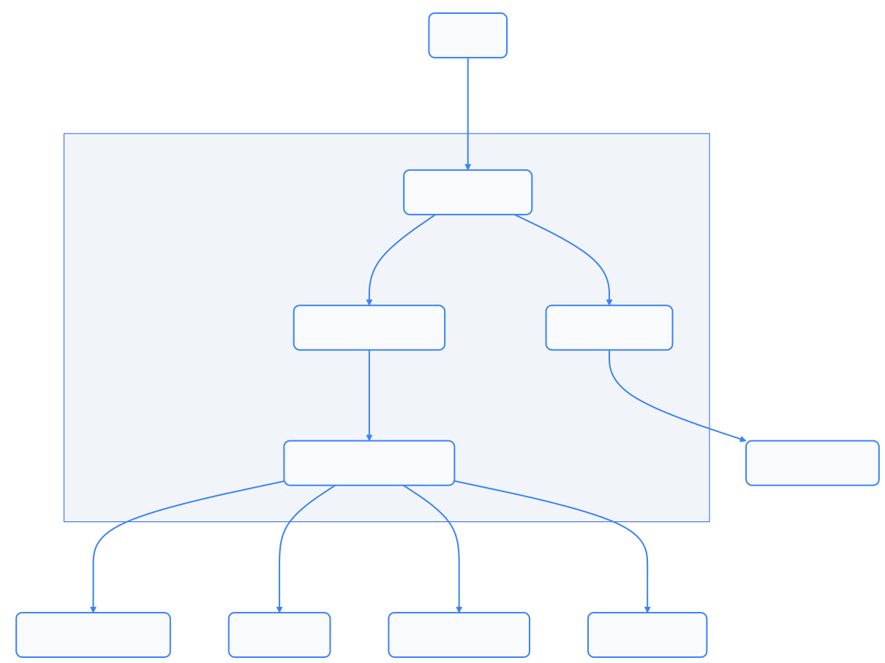
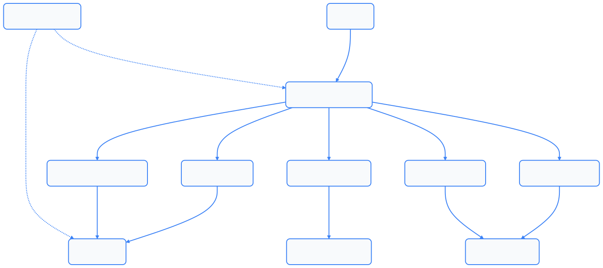

> k9s 是 Kubernetes 集群管理的高效终端 UI 工具，支持键盘驱动操作、实时监控和资源管理，极大提升了命令行用户的运维效率和体验。

## k9s 简介

[k9s](https://github.com/derailed/k9s) 是专为 Kubernetes 设计的终端用户界面工具，采用类似 Vim 的操作方式，通过键盘快捷键实现高效导航和操作，是 kubectl 的强大补充。

## 架构概览

k9s 遵循清晰的架构模式，将 UI 展示、Kubernetes 资源访问和应用逻辑分离。下图展示了主要架构组件及其交互关系。

```mermaid "k9s 架构总览"
graph TD
    User["User"] --> CLI["CLI/Cobra Commands"]
    CLI --> App["K9s App"]
    App --> Config["Configuration System"]
    App --> UI["UI System"]
    App --> K8sClient["Kubernetes Client"]
    K8sClient --> K8sAPI["Kubernetes API"]
    UI --> Views["Resource Views"]
    UI --> Table["Table System"]
    UI --> Menu["Menu"]
    UI --> Prompt["Prompt"]
    Views --> ResourceViewers["Resource Viewers"]
    ResourceViewers --> DAOs["Data Access Objects"]
    ResourceViewers --> Renderers["Renderers"]
    DAOs --> K8sClient
    Config --> Styles["Styles"]
    Config --> Plugins["Plugins"]
    Config --> HotKeys["HotKeys"]
    Config --> Aliases["Aliases"]
    subgraph "Core Components"
        App
        UI
        K8sClient
        Config
    end
    subgraph "Resource Management"
        DAOs
        Renderers
        ResourceViewers
    end
```


{width=2774 height=1607}

应用启动流程如下：

```mermaid "k9s 应用启动流程"
sequenceDiagram
    participant Main
    participant Cobra as "Cobra Command"
    participant Config as "Configuration"
    participant App
    participant K8sClient
    participant UI
    Main->>Cobra: Execute()
    Cobra->>Cobra: run()
    Cobra->>Config: loadConfiguration()
    Config->>K8sClient: InitConnection()
    Cobra->>App: NewApp(cfg)
    App->>App: Init(version, refreshRate)
    App->>K8sClient: Connect to cluster
    App->>UI: Setup Terminal UI
    App->>App: Run() starts event loop
```


{width=1920 height=1037}

## 核心组件解析

k9s 通过模块化设计实现高效的资源管理和用户交互，以下为主要组件说明。

### 命令系统

命令系统解释用户输入并将其转换为操作，支持导航、过滤和 Kubernetes 操作。

```mermaid "k9s 命令系统"
graph TD
    User["User"] -->|"Types command"| CmdBuff["Command Buffer"]
    CmdBuff -->|"Interprets"| Interpreter["Command Interpreter"]
    Interpreter -->|"Parses"| CommandObj["Command Object"]
    CommandObj -->|"Executes"| Action["Application Action"]
    CommandObj -->|"Resource Command"| ResourceViewer["Resource Viewer"]
    CommandObj -->|"Context Command"| ContextSwitch["Context Switch"]
    CommandObj -->|"Namespace Command"| NamespaceSwitch["Namespace Switch"]
    CommandObj -->|"Special Command"| SpecialAction["Special Action"]
    subgraph "Command Execution"
        ResourceViewer
        ContextSwitch
        NamespaceSwitch
        SpecialAction
    end
```


{width=1920 height=1299}

### 配置系统

k9s 使用分层配置系统，结合全局默认值、用户偏好和上下文特定设置。

```mermaid "k9s 配置系统"
graph TD
    ConfigFile["Config Files"] -->|"Load"| ConfigSystem["Configuration System"]
    Flags["CLI Flags"] -->|"Override"| ConfigSystem
    ConfigSystem -->|"Global Config"| GlobalConfig["Global K9s Config"]
    ConfigSystem -->|"Context Config"| ContextConfig["Context-Specific Config"]
    GlobalConfig --> UI["UI Settings"]
    GlobalConfig --> Logger["Logger Settings"]
    GlobalConfig --> General["General Settings"]
    ContextConfig --> Namespace["Active Namespace"]
    ContextConfig --> View["Active View"]
    ContextConfig --> Aliases["Command Aliases"]
    ContextConfig --> HotKeys["Custom HotKeys"]
    subgraph "Configuration Hierarchy"
        GlobalConfig
        ContextConfig
    end
```


{width=1920 height=778}

### 资源视图系统

k9s 通过统一的 `ResourceViewer` 接口表示不同的 Kubernetes 资源，Browser 是主要实现，用于显示表格数据。

```mermaid "k9s 资源视图系统"
classDiagram
    class ResourceViewer {
        <<interface>>
        +Init(context.Context) error
        +App() *App
        +Start()
        +Stop()
        +GetTable() *Table
    }
    class Table {
        -model *model.Table
        +Init(context)
        +Update(data)
        +Start()
        +Stop()
    }
    class Browser {
        -table *Table
        -accessor dao.Accessor
        -meta *metav1.APIResource
        +Init(context.Context)
        +SetInstance(path)
        +SetContextFn(ContextFunc)
    }
    class LogViewer {
        -model *model.Log
        -logs *Logger
        +Init(context.Context)
        +SetContainer(container)
    }
    ResourceViewer <|.. Browser
    ResourceViewer <|.. LogViewer
    Browser *-- Table
```


{width=1920 height=3025}

### 数据访问层

k9s 使用 DAO 模式抽象 Kubernetes 资源检索和操作。

```mermaid "k9s 数据访问层"
graph TD
    App["App"] --> Factory["Watch Factory"]
    Factory -->|"Creates"| Accessor["Resource Accessor"]
    Factory -->|"Manages"| Informers["K8s Informers"]
    Accessor -->|"Resource-specific"| ResourceDAO["Resource-specific DAO"]
    ResourceDAO -->|"Retrieves"| K8sObjects["Kubernetes Objects"]
    ResourceDAO -->|"Pod"| PodDAO["Pod DAO"]
    ResourceDAO -->|"Deployment"| DeploymentDAO["Deployment DAO"]
    ResourceDAO -->|"Service"| ServiceDAO["Service DAO"]
    Informers -->|"Watch"| K8sAPI["Kubernetes API"]
    subgraph "Data Access Layer"
        Factory
        Accessor
        ResourceDAO
        Informers
    end
```


{width=1920 height=1442}

### 核心组件总览



| 组件      | 类型   | 角色                                   |
|-----------|--------|----------------------------------------|
| App       | 核心   | 协调所有其他组件的主应用程序           |
| Command   | 核心   | 解释和执行用户命令                     |
| Browser   | 视图   | 显示表格数据的通用资源查看器           |
| Table     | UI     | 显示表格数据的 UI 组件                 |
| DAO       | 数据   | Kubernetes 资源的数据访问对象           |
| Factory   | 数据   | 创建和管理 Kubernetes informers/watchers|
| Config    | 配置   | 管理应用程序配置                       |
| K9s       | 配置   | 存储 K9s 特定配置                      |



## 主要特性

k9s 提供丰富的功能，满足日常运维和开发调试需求。

### 高效导航

- 键盘驱动：完全通过键盘操作，无需鼠标
- 快速切换：支持不同资源类型、命名空间间快速切换
- 智能搜索：支持资源名称和标签的模糊搜索
- 书签功能：保存常用资源视图和过滤器

### 实时监控

- 实时更新：自动刷新集群资源状态
- 状态指示：颜色编码显示资源状态
- 事件流：实时显示集群事件和告警
- 资源使用率：显示 CPU、内存使用情况

### 资源管理

- 多资源视图：支持 Pod、Deployment、Service 等所有资源类型
- 批量操作：支持多个资源批量操作
- YAML/JSON 查看：原地查看和编辑资源配置
- 日志查看：集成 Pod 日志查看和搜索功能

### 高级功能

- 插件系统：支持自定义命令和脚本
- 多集群支持：轻松在多个集群间切换
- RBAC 可视化：显示用户权限和角色绑定
- 网络诊断：内置网络连接测试工具

## 安装与使用

k9s 支持多种安装方式，适配主流操作系统。

### 安装 k9s

#### 使用包管理器安装

**macOS (Homebrew)：**

```bash
brew install k9s
```

**Ubuntu/Debian：**

```bash
curl -LO https://github.com/derailed/k9s/releases/latest/download/k9s_linux_amd64.deb
sudo dpkg -i k9s_linux_amd64.deb
```

**CentOS/RHEL/Fedora：**

```bash
curl -LO https://github.com/derailed/k9s/releases/latest/download/k9s_linux_amd64.rpm
sudo rpm -i k9s_linux_amd64.rpm
```

#### 从源码编译安装

```bash
go install github.com/derailed/k9s@latest
```

#### 使用 kubectl krew 安装

```bash
kubectl krew install k9s
kubectl k9s
```

### 配置 kubeconfig

k9s 会自动检测和使用现有的 kubeconfig 文件：

```bash
# 查看当前配置
k9s --help

# 指定特定 kubeconfig 文件
k9s --kubeconfig ~/.kube/config

# 连接到特定集群
k9s --cluster my-cluster
```

## 界面导航与操作

k9s 提供丰富的视图和快捷操作，提升集群管理效率。

### 主要视图

- `:pods` - Pod 管理视图
- `:deployments` - Deployment 管理视图
- `:services` - Service 管理视图
- `:configmaps` - ConfigMap 管理视图
- `:secrets` - Secret 管理视图
- `:jobs` - Job 管理视图
- `:cronjobs` - CronJob 管理视图
- `:nodes` - 节点管理视图

### 基本操作

#### 导航命令

- `h/l` 或 `←/→` - 左右移动
- `j/k` 或 `↑/↓` - 上下移动
- `g/G` - 跳到顶部/底部
- `/` - 搜索模式
- `n/N` - 下一个/上一个搜索结果

#### 资源操作

- `Enter` - 查看资源详情
- `e` - 编辑资源 (YAML)
- `d` - 删除资源
- `l` - 查看日志
- `s` - 查看资源使用的 Secret
- `p` - 端口转发

#### 视图切换

- `:` - 命令模式，输入资源类型
- `Tab` - 在不同面板间切换
- `Ctrl-a` - 显示所有命名空间
- `Ctrl-n` - 选择命名空间

## 高级功能与扩展

k9s 支持插件、皮肤、别名和快捷键等多种扩展方式，满足个性化需求。

### 插件系统

k9s 支持自定义插件扩展功能：

```bash
# 创建插件目录
mkdir -p ~/.config/k9s/plugins

# 创建插件文件
cat > ~/.config/k9s/plugins/plugin.yaml <<EOF
plugins:
  trouble-shoot:
    shortCut: Shift-T
    description: Trouble shoot pod
    scopes:
    - pods
    command: kubectl
    background: false
    args:
    - describe
    - $NAME
    - -n
    - $NAMESPACE
EOF
```

在 Pod 视图中按 `Shift-T` 执行故障排查插件。

### 皮肤和主题

自定义界面主题：

```bash
# 创建皮肤目录
mkdir -p ~/.config/k9s/skins

# 创建自定义皮肤
cat > ~/.config/k9s/skins/my-skin.yaml <<EOF
k9s:
  body:
    fgColor: dodgerblue
    bgColor: black
  info:
    fgColor: white
    bgColor: black
  frame:
    fgColor: dodgerblue
    bgColor: black
EOF
```

### 别名和快捷键

自定义命令别名：

```bash
# 编辑配置文件
k9s info

# 在配置文件中添加别名
aliases:
  dp: deployments
  po: pods
  svc: services
```

### 扩展点说明

- 命令别名：自定义命令快捷方式
- 自定义视图：如 XRay 资源关系查看
- 热键：自定义键盘快捷键
- 插件：与外部工具集成

### 配置和定制

k9s 通过配置文件、别名、热键和皮肤实现高度定制。

```mermaid "k9s 配置与定制"
graph TD
    User["User"] -->|"Edits"| ConfigFiles["Configuration Files"]
    ConfigFiles -->|"k9s.yaml"| GlobalConfig["Global Config"]
    ConfigFiles -->|"context_{name}.yaml"| ContextConfig["Context-specific Config"]
    ConfigFiles -->|"aliases.yaml"| Aliases["Command Aliases"]
    ConfigFiles -->|"hotkeys.yaml"| Hotkeys["Custom Hotkeys"]
    ConfigFiles -->|"{skin}.yaml"| Skins["UI Skins/Themes"]
    GlobalConfig -->|"Loads on startup"| App["K9s App"]
    ContextConfig -->|"Loads on context switch"| App
    Aliases -->|"Command resolution"| Command["Command System"]
    Hotkeys -->|"Key bindings"| UI["User Interface"]
    Skins -->|"Colors and styles"| UI
    ConfigWatcher["Config Watcher"] -.->|"Watch for changes"| ConfigFiles
    ConfigWatcher -.->|"Hot reload"| App
```


{width=1920 height=855}

## 实用场景

k9s 适用于日常运维、开发调试和生产环境管理，以下为常见场景示例。

### 日常运维

- 快速查看集群状态：

    ```bash
    k9s
    # 默认进入 Pod 视图，快速概览集群状态
    ```

- 监控应用部署：

    ```bash
    k9s -c deployments
    # 直接进入 Deployment 视图
    ```

- 排查 Pod 问题：

    ```bash
    k9s -c pods
    # 选择有问题的 Pod，按 'l' 查看日志
    # 按 'd' 查看详细信息
    ```

### 开发调试

- 实时日志监控：

    ```bash
    k9s
    # 选择 Pod，按 'l' 进入日志视图
    # 使用 '/' 搜索特定日志内容
    ```

- 配置调试：

    ```bash
    k9s -c configmaps
    # 查看配置映射内容
    ```

- 网络诊断：

    ```bash
    k9s -c services
    # 查看服务端点状态
    ```

### 生产运维

- 资源监控：

    ```bash
    k9s -c nodes
    # 查看节点资源使用情况
    ```

- 批量操作：

    ```bash
    k9s -c pods -n production
    # 在生产命名空间中管理 Pod
    ```

- 安全审计：

    ```bash
    k9s -c secrets
    # 查看密钥资源
    ```

## 配置选项

k9s 支持多种配置文件，满足不同环境和个性化需求。

### 配置文件位置

- Linux/macOS: `~/.config/k9s/config.yaml`
- Windows: `%APPDATA%\k9s\config.yaml`

### 常用配置示例

```yaml
k9s:
  ui:
    enableMouse: false
    logoless: true
    crumbsless: false
  clusters:
    my-cluster:
      namespace:
        active: default
        favorites:
        - kube-system
        - default
  plugins:
    trouble-shoot:
      shortCut: Shift-T
      command: kubectl
      args:
      - describe
      - $NAME
```

## 故障排查

k9s 提供多种故障排查手段，帮助用户快速定位和解决问题。

### 常见问题

- 连接集群失败：检查 kubeconfig 路径和权限，验证证书和网络
- 权限不足：检查 RBAC 配置，确认 ServiceAccount 和 ClusterRoleBinding
- 界面显示异常：检查终端支持，更新版本，重置配置
- 插件不工作：检查插件语法和命令路径，查看日志输出

## 最佳实践

- 熟练掌握键盘操作，提高效率
- 合理使用命名空间，按团队或环境组织资源
- 配置监控视图，设置常用资源视图和过滤器
- 定期更新，获取新功能和修复

## 总结

k9s 通过模块化架构将 UI、数据访问和业务逻辑分离，命令系统作为中央协调器，配置系统支持高度定制。资源查看系统和数据访问层为 Kubernetes 资源管理提供一致接口，极大提升了集群运维和开发效率。

## 参考文献

1. [k9s GitHub 仓库 - github.com](https://github.com/derailed/k9s)
2. [官方文档 - k9scli.io](https://k9scli.io/)
3. [kubectl krew 插件 - krew.sigs.k8s.io](https://krew.sigs.k8s.io/plugins/)
4. [社区贡献 - github.com](https://github.com/derailed/k9s/contributing)
5. [k9s 架构文档 - github.com](https://github.com/derailed/k9s/blob/master/docs/architecture.md)
