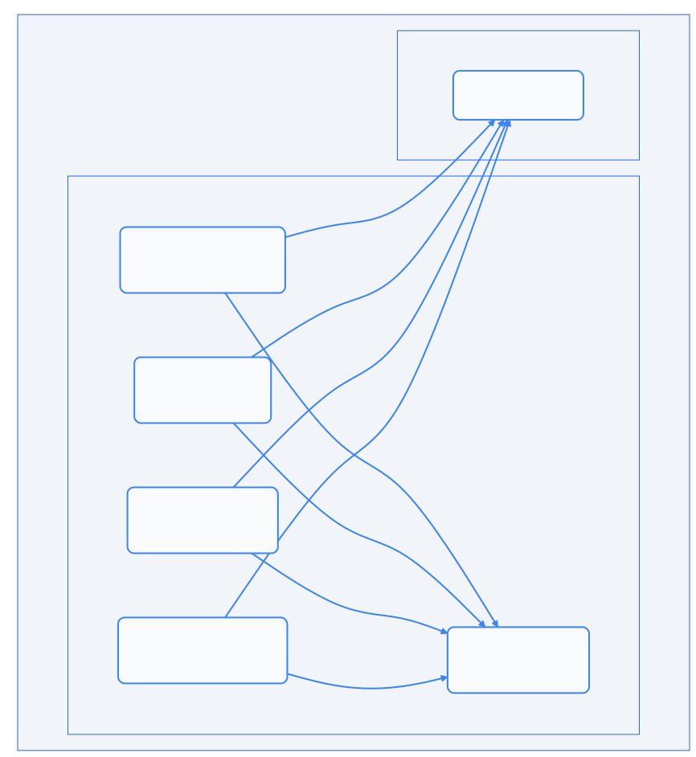
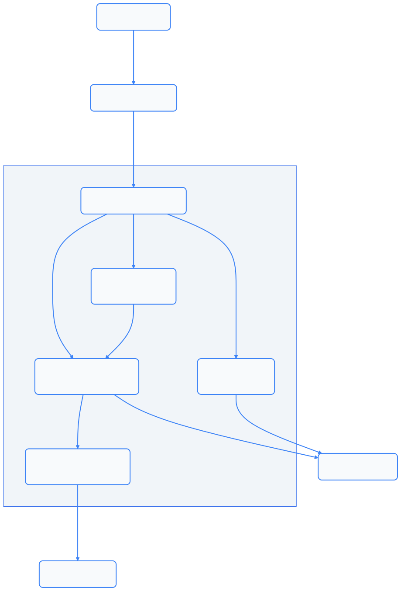
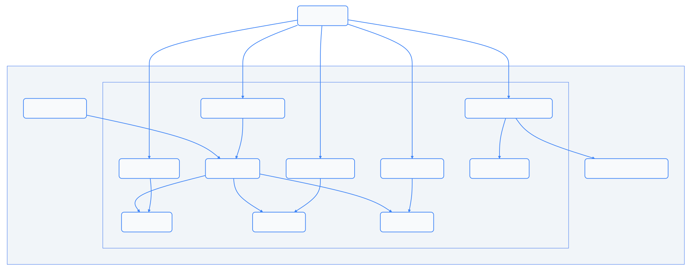

[Kubernetes Dashboard](https://github.com/kubernetes/dashboard) 是 Kubernetes 官方提供的通用 Web UI，用于管理 Kubernetes 集群中的应用和资源。它提供了直观的可视化界面，帮助用户轻松查看和管理集群中的各种资源。

## 项目结构

Kubernetes Dashboard 由一组微服务组成，每个服务服务于特定目的。从版本 7.0.0 开始，Dashboard 仅支持基于 Helm 的安装，因为其多容器设置和对 Kong Gateway 作为中央 API 代理的依赖。

```mermaid
graph TB
    subgraph "Kubernetes Dashboard Repository"
        subgraph "Core Modules"
            web["Web<br>(Angular Frontend)"]
            api["API<br>(Go Backend)"]
            auth["Auth<br>(Authentication)"]
            metrics["Metrics Scraper<br>(Performance Data)"]
            common["Common<br>(Shared Code)"]
        end

        subgraph "Deployment"
            charts["Helm Charts"]
        end

        web --> common
        api --> common
        auth --> common
        metrics --> common

        web & api & auth & metrics --> charts
    end
```


{width=1920 height=2088}

## 系统架构

Kubernetes Dashboard 遵循微服务架构，以中央 API 代理（Kong Gateway）路由流量并向用户公开 UI。

```mermaid
graph TD
    User["Browser User"] -->|"Access"| Ingress["Ingress Controller"]
    Ingress -->|"Routes to"| Kong["Kong Gateway API Proxy"]

    subgraph "Kubernetes Dashboard Components"
        Kong -->|"Routes to"| WebUI["Web UI<br>Angular Frontend"]
        Kong -->|"Routes to"| API["API Module<br>REST/GraphQL Backend"]
        Kong -->|"Routes to"| Auth["Auth Module<br>Authentication"]
        API -->|"Uses"| MetricsScraper["Metrics Scraper<br>Performance Monitoring"]
    end

    WebUI -->|"HTTP Requests"| API
    API -->|"Queries"| K8sAPI["Kubernetes API"]
    MetricsScraper -->|"Collects from"| MetricsServer["Metrics Server"]
    Auth -->|"Validates"| K8sAPI
```


{width=1920 height=2827}

## 核心组件

Kubernetes Dashboard 由几个核心组件组成，每个组件负责特定功能：

| 组件 | 技术 | 目的 |
| --- | --- | --- |
| Web UI | Angular 16 | 提供与 Kubernetes 集群交互的用户界面 |
| API Module | Go | 处理 REST 和 GraphQL API 请求，与 Kubernetes API 交互 |
| Auth Module | Go | 管理认证和授权 |
| Metrics Scraper | Go | 从 Kubernetes Metrics Server 收集性能指标 |
| Kong Gateway | Kong | 中央 API 代理，在组件之间路由流量 |

### Web UI 模块

Web UI 使用 Angular 构建，为 Dashboard 提供用户界面。它与 API 模块通信以获取和操作 Kubernetes 资源。

关键技术：

- Angular 16.2.1
- Angular Material 14.2.7
- Angular Flex Layout
- NgX-Charts 用于数据可视化
- XTerm 用于终端仿真

### API 模块

API 模块作为 Dashboard 的后端，提供 REST 和 GraphQL API 以供前端交互。它与 Kubernetes API 通信以管理集群资源。

关键技术：

- Go
- REST 和 GraphQL API
- Kubernetes 客户端库

### 认证模块

认证模块处理 Dashboard 的认证和授权。它根据 Kubernetes API 服务器验证用户令牌。

```mermaid
sequenceDiagram
    actor "User" as User
    participant "Browser" as Browser
    participant "Dashboard" as Dashboard
    participant "Auth Service" as Auth
    participant "Kubernetes API" as K8sAPI

    User->>Browser: Access Dashboard URL
    Browser->>Dashboard: HTTP Request
    Dashboard->>Browser: Redirect to Login

    User->>Browser: Enter Token
    Browser->>Dashboard: Send Token
    Dashboard->>Auth: Validate Token
    Auth->>K8sAPI: Authenticate
    K8sAPI-->>Auth: Authentication Result
    Auth-->>Dashboard: Auth Status

    alt Authentication Success
        Dashboard->>Browser: Display Dashboard UI
    else Authentication Failure
        Dashboard->>Browser: Display Error
    end
```


{width=2099 height=777}

### Metrics Scraper

Metrics Scraper 从 Kubernetes Metrics Server 收集性能指标，并将其存储以在 Dashboard 中进行可视化。

关键技术：

- Go
- SQLite 用于指标存储
- Kubernetes Metrics API 客户端

## 部署架构

Kubernetes Dashboard 使用 Helm 作为一组容器部署在 Kubernetes 集群中。Helm Chart 在 `kubernetes-dashboard` 命名空间中创建必要的资源。

```mermaid
graph TD
    subgraph "Kubernetes Cluster"
        subgraph "kubernetes-dashboard Namespace"
            kongDeploy["Kong Gateway Deployment"]
            apiDeploy["API Deployment"]
            webDeploy["Web UI Deployment"]
            authDeploy["Auth Deployment"]
            metricsDeploy["Metrics Scraper Deployment"]

            kongSvc["Kong Service"]
            apiSvc["API Service"]
            webSvc["Web Service"]
            authSvc["Auth Service"]
            metricsSvc["Metrics Service"]
        end

        ingress["Ingress Resource"]
        metricsServer["Kubernetes Metrics Server"]
    end

    helmChart["Helm Chart"] -->|"Installs"| kongDeploy & apiDeploy & webDeploy & authDeploy & metricsDeploy

    kongDeploy --> kongSvc
    apiDeploy --> apiSvc
    webDeploy --> webSvc
    authDeploy --> authSvc
    metricsDeploy --> metricsSvc

    ingress --> kongSvc
    kongSvc --> webSvc & apiSvc & authSvc
    metricsDeploy -->|"Queries"| metricsServer
```


{width=2112 height=823}

## 开发和构建系统

Kubernetes Dashboard 使用模块化构建系统，以 Makefile 作为主要的编排工具。这构建各个模块并生成 Docker 镜像，然后打包到 Helm Chart 中。

```mermaid
graph LR
    subgraph "Development Process"
        code["Source Code"]
        build["Build Process"]
        docker["Docker Images"]
        helm["Helm Chart"]
        deploy["Deployment"]
    end

    code -->|"make build"| build
    build -->|"Create"| docker
    docker -->|"Package"| helm
    helm -->|"helm install"| deploy
```


{width=1920 height=6818}

## 主要特性

### 资源管理

- **多集群支持**：支持连接和管理多个 Kubernetes 集群
- **资源概览**：提供集群、节点、命名空间的整体状态视图
- **工作负载管理**：支持查看和管理 Deployment、Pod、Service 等资源
- **存储管理**：查看和管理 PersistentVolume、PersistentVolumeClaim 等存储资源

### 应用部署

- **YAML/JSON 编辑器**：内置的资源配置编辑器，支持直接编辑 YAML 配置
- **向导式部署**：提供简单的应用部署向导
- **日志查看**：集成 Pod 日志查看功能
- **Shell 访问**：提供对 Pod 的终端访问

### 监控与诊断

- **实时状态监控**：显示资源的使用情况和健康状态
- **事件查看**：查看集群中的事件和告警信息
- **配置查看**：查看 ConfigMap 和 Secret 的内容
- **RBAC 可视化**：显示用户和角色的权限配置

## 安装部署

### 使用 Helm 安装

推荐使用 Helm Chart 安装 Kubernetes Dashboard：

```bash
# 添加 Kubernetes Dashboard 仓库
helm repo add kubernetes-dashboard https://kubernetes.github.io/dashboard/
helm repo update

# 安装 Dashboard
helm install kubernetes-dashboard kubernetes-dashboard/kubernetes-dashboard \
  --create-namespace \
  --namespace kubernetes-dashboard

# 创建管理员 ServiceAccount
kubectl create serviceaccount dashboard-admin -n kubernetes-dashboard

# 创建 ClusterRoleBinding
kubectl create clusterrolebinding dashboard-admin \
  --clusterrole=cluster-admin \
  --serviceaccount=kubernetes-dashboard:dashboard-admin

# 获取访问令牌
kubectl get secret -n kubernetes-dashboard \
  $(kubectl get serviceaccount dashboard-admin -n kubernetes-dashboard -o jsonpath="{.secrets[0].name}") \
  -o jsonpath="{.data.token}" | base64 --decode
```

### 手动安装

如果不使用 Helm，可以直接应用官方的 YAML 文件：

```bash
# 部署 Dashboard
kubectl apply -f https://raw.githubusercontent.com/kubernetes/dashboard/v3.0.0-alpha0/charts/kubernetes-dashboard.yaml

# 创建管理员用户
kubectl apply -f - <<EOF
apiVersion: v1
kind: ServiceAccount
metadata:
  name: admin-user
  namespace: kubernetes-dashboard
---
apiVersion: rbac.authorization.k8s.io/v1
kind: ClusterRoleBinding
metadata:
  name: admin-user
roleRef:
  apiGroup: rbac.authorization.k8s.io
  kind: ClusterRole
  name: cluster-admin
subjects:
- kind: ServiceAccount
  name: admin-user
  namespace: kubernetes-dashboard
EOF
```

## 访问 Dashboard

### 端口转发访问

```bash
# 创建端口转发
kubectl port-forward -n kubernetes-dashboard service/kubernetes-dashboard-kong-proxy 8443:443
```

然后访问 `https://localhost:8443`

### Ingress 访问

创建 Ingress 资源以提供外部访问：

```yaml
apiVersion: networking.k8s.io/v1
kind: Ingress
metadata:
  name: kubernetes-dashboard
  namespace: kubernetes-dashboard
  annotations:
    nginx.ingress.kubernetes.io/backend-protocol: "HTTPS"
spec:
  ingressClassName: nginx
  rules:
  - host: dashboard.example.com
    http:
      paths:
      - path: /
        pathType: Prefix
        backend:
          service:
            name: kubernetes-dashboard-kong-proxy
            port:
              number: 443
```

## 认证与授权

### 令牌认证

1. 获取 ServiceAccount 的访问令牌：

    ```bash
    kubectl get secret -n kubernetes-dashboard \
      $(kubectl get serviceaccount admin-user -n kubernetes-dashboard -o jsonpath="{.secrets[0].name}") \
      -o jsonpath="{.data.token}" | base64 --decode
    ```

2. 在 Dashboard 登录页面选择 "Token" 认证方式
3. 输入获取到的令牌

### Kubeconfig 认证

Dashboard 也支持使用 kubeconfig 文件进行认证，需要配置适当的 RBAC 权限。

## 界面功能

### 主页面

- 显示集群概览信息
- 节点状态和工作负载统计
- 最近的事件和告警

### 工作负载页面

- 查看和管理 Deployment、Pod、ReplicaSet 等
- 执行扩缩容、滚动更新等操作
- 查看 Pod 日志和事件

### 服务发现页面

- 管理 Service 和 Ingress 资源
- 查看端点信息

### 配置页面

- 查看和管理 ConfigMap 和 Secret
- 查看 PersistentVolume 和 PersistentVolumeClaim

## 安全注意事项

1. **HTTPS 访问**：始终使用 HTTPS 访问 Dashboard
2. **最小权限原则**：不要为所有用户分配 cluster-admin 权限
3. **网络隔离**：在生产环境中使用防火墙和网络策略限制访问
4. **定期更新**：及时更新到最新版本以获取安全补丁

## 故障排查

### 常见问题

**无法访问 Dashboard**

- 检查 Service 和 Pod 状态
- 确认端口转发或 Ingress 配置正确
- 检查防火墙设置

**认证失败**

- 确认令牌未过期
- 检查 ServiceAccount 和 RBAC 配置
- 验证集群连接状态

**权限不足**

- 检查用户角色和权限绑定
- 确认 ClusterRoleBinding 配置正确

## 参考资料

- [Kubernetes Dashboard GitHub](https://github.com/kubernetes/dashboard)
- [官方文档](https://kubernetes.io/docs/tasks/access-application-cluster/web-ui-dashboard/)
- [Helm Chart](https://artifacthub.io/packages/helm/k8s-dashboard/kubernetes-dashboard)
