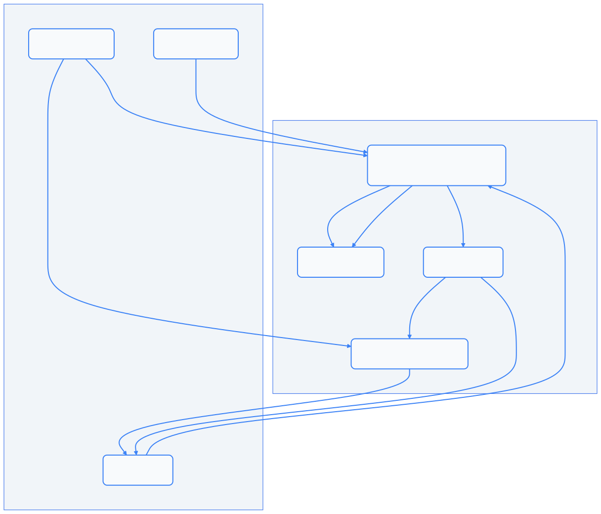
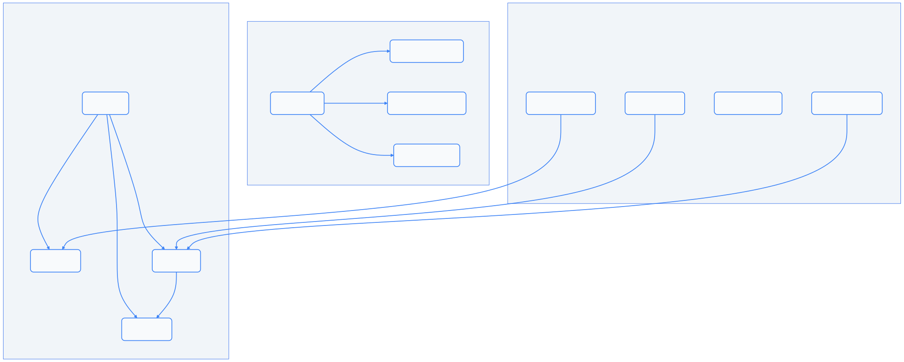

> Etcd 是 Kubernetes 集群的核心分布式存储组件，本文系统梳理其架构原理、核心特性、数据结构、运维实践及安全优化，帮助读者全面理解其在云原生体系中的关键作用。

## Etcd 简介

Etcd 是 Kubernetes 集群的核心组件之一，作为分布式键值存储系统，负责保存集群的所有配置信息和状态数据。本文将深入解析 etcd 在 Kubernetes 中的作用、原理和使用方法。

## Etcd 的核心职责与特性

Etcd 作为高可用的分布式键值存储系统，采用 Raft 共识算法保证数据一致性。在 Kubernetes 生态系统中，etcd 主要承担以下职责：

- 集群状态存储：保存所有 Kubernetes 对象的状态信息和元数据
- 配置管理：存储集群配置和各种资源定义
- 服务发现：为集群组件提供服务注册和发现功能
- 分布式锁：支持分布式协调和同步操作

### 核心特性

- 简单性：定义良好的用户 API (gRPC)
- 安全性：自动 TLS，可选客户端证书认证
- 高性能：基准测试显示 10,000 次写入/秒
- 可靠性：使用 Raft 共识算法正确分布
- 一致性：强一致性读写
- 高可用性：容忍机器故障，包括 leader 故障

Etcd 在生产环境中广泛使用，特别是作为 [Kubernetes](http://kubernetes.io/) 的主要数据存储和其他需要可靠协调服务的分布式系统。

## 架构与组件解析

Etcd 遵循客户端 - 服务器架构，其中多个 etcd 服务器实例形成集群。客户端使用 etcd 客户端库或 etcdctl 命令行工具与集群通信。

### 系统架构概览

下图展示了 etcd 的主要架构组件及其交互关系。

```mermaid "Etcd 系统架构"
flowchart TD
    subgraph "Clients"
        ClientApp["Client Applications"]
        etcdctl["etcdctl Command Line"]
    end

    subgraph "Client Interface"
        ClientLibraries["clientv3 Libraries"]
        gRPC["gRPC API"]
    end

    subgraph "etcd Server"
        Server["EtcdServer"]
        Auth["AuthStore"]
        MVCC["MVCC Store"]
        Lease["Lease Manager"]
        Raft["Raft Consensus"]
        WAL["Write-Ahead Log"]
        Backend["bbolt Backend"]
    end

    ClientApp -->|API calls| ClientLibraries
    etcdctl --> ClientLibraries
    ClientLibraries -->|RPC| gRPC
    gRPC --> Auth
    Auth --> Server
    Server --> MVCC
    Server --> Lease
    Server --> Raft
    MVCC --> Backend
    Lease --> Backend
    Raft --> WAL
    WAL --> Backend
```


{width=1920 height=3680}

Etcd 架构由以下关键组件组成：

- 客户端接口：为应用程序提供 gRPC API 和客户端库以与 etcd 交互
- 服务器核心 (EtcdServer)：处理客户端请求，协调集群操作
- 认证系统：管理认证和基于角色的访问控制
- MVCC 存储：多版本并发控制存储，维护版本化的键值数据
- 租约系统：管理键 TTL 和过期
- Raft 共识：实现 Raft 算法进行分布式共识
- 存储：包括预写日志 (WAL) 和 bbolt 数据库后端

### 请求处理流程

下图说明了不同类型的请求如何通过 etcd 系统处理：

```mermaid "Etcd 请求处理流程"
sequenceDiagram
    participant Client as Client Application
    participant ClientLib as clientv3 Library
    participant Server as EtcdServer
    participant Auth as AuthStore
    participant MVCC as MVCC Store
    participant Raft as Raft Node
    participant WAL as Write-Ahead Log
    participant Backend as bbolt Backend

    Client->>ClientLib: Operation (Put/Get/Delete)
    ClientLib->>Server: gRPC Request

    alt Read Operation (Serializable)
        Server->>Auth: IsRangePermitted
        Auth-->>Server: Permission Result
        Server->>MVCC: Range
        MVCC->>Backend: Read from storage
        Backend-->>MVCC: Return data
        MVCC-->>Server: Return result
    else Read Operation (Linearizable)
        Server->>Server: linearizableReadNotify
        Server->>Raft: ReadIndex
        Raft-->>Server: ReadIndex response
        Server->>Auth: IsRangePermitted
        Auth-->>Server: Permission Result
        Server->>MVCC: Range
        MVCC->>Backend: Read from storage
        Backend-->>MVCC: Return data
        MVCC-->>Server: Return result
    else Write Operation
        Server->>Server: raftRequest
        Server->>Raft: Process (Propose)
        Raft->>WAL: Record proposal
        Raft->>Raft: Reach consensus
        Raft-->>Server: Committed entry
        Server->>Auth: Check permissions
        Auth-->>Server: Permission Result
        Server->>MVCC: Apply changes
        MVCC->>Backend: Write to storage
        Backend-->>MVCC: Confirm write
        MVCC-->>Server: Return result
    end

    Server-->>ClientLib: gRPC Response
    ClientLib-->>Client: Operation Result
```


{width=1920 height=2024}

读取操作可分为可序列化（可能过时）和线性化（保证最新）；写入操作始终通过 Raft 共识过程以确保跨集群一致性。

## 核心原理与组件

Etcd 采用 [Raft 共识算法](http://thesecretlivesofdata.com/raft/) 实现分布式一致性，确保即使在部分节点故障的情况下，集群仍能正常工作并保持数据一致性。

### Raft 共识算法与架构特点

- 强一致性：通过 Raft 算法保证所有节点数据一致
- 高可用性：支持集群部署，容忍少数节点故障
- 可靠性：提供数据持久化和自动故障恢复
- 性能优化：支持批量操作和 watch 机制

详细的架构分析请参考：[Etcd 架构与实现解析](http://jolestar.com/etcd-architecture/)

### 主要组件解析

#### EtcdServer

`EtcdServer` 是中央协调组件，处理客户端请求、管理 Raft 共识协议，并集成所有其他 etcd 子系统。它在 [server/etcdserver/server.go](https://github.com/etcd-io/etcd/blob/eac44d59/server/etcdserver/server.go) 中定义，并实现了多个接口，包括 `Server`、`RaftStatusGetter` 和 `Authenticator`。

主要职责：

- 将客户端请求应用到状态机
- 协调集群成员变更
- 管理租约和监听
- 编排快照和压缩

#### Raft 共识

etcd 使用 Raft 共识算法维护集群一致性。[server/etcdserver/raft.go](https://github.com/etcd-io/etcd/blob/eac44d59/server/etcdserver/raft.go) 中的 `raftNode` 结构封装了 Raft 协议实现：

```mermaid "Raft 节点与 EtcdServer 交互"
flowchart TD
    subgraph "RaftNode"
        Node["raft.Node"]
        MemoryStorage["raft.MemoryStorage"]
        MsgSnapC["msgSnapC channel"]
        ApplyC["applyc channel"]
        ReadStateC["readStateC channel"]
    end

    subgraph "EtcdServer"
        Server["EtcdServer"]
        Apply["apply()"]
        Process["process()"]
    end

    subgraph "Transport"
        RaftHTTP["rafthttp.Transport"]
        Peers["Peer Connections"]
    end

    Node --> MemoryStorage
    Node -->|"Sends Ready"| Server
    Server -->|"Proposes"| Node
    Server -->|"Processes ReadIndex"| Node
    Server -->|"Applies entries"| Apply
    Apply -->|"Reads from"| ApplyC
    Node -->|"Sends to"| ApplyC
    Node -->|"Sends to"| ReadStateC
    Node -->|"Sends snapshots to"| MsgSnapC

    RaftHTTP -->|"Connects to"| Peers
    Server -->|"Sends/Receives via"| RaftHTTP
    RaftHTTP -->|"Delivers messages to"| Node
```


{width=2086 height=894}

Raft 实现的关键方面：

- leader 选举用于协调写入
- 日志复制以维护一致性
- 安全特性以防止脑裂场景
- 成员变更（添加/删除节点）

#### 存储系统

etcd 的存储系统由多个层组成：

```mermaid "Etcd 存储层次结构"
flowchart TD
    subgraph "Storage Layers"
        MVCC["MVCC (Multi-Version Concurrency Control)"]
        Backend["bbolt Backend"]
        WAL["Write-Ahead Log (WAL)"]
        Snapshot["Snapshotter"]
    end

    subgraph "Data Flow"
        Write["Write Request"]
        Read["Read Request"]
        Recovery["Recovery"]
    end

    Write -->|"1. Log"| WAL
    Write -->|"2. Propose"| MVCC
    MVCC -->|"3. Commit"| Backend
    Read -->|"Query"| MVCC
    MVCC -->|"Retrieve"| Backend

    WAL -->|"Replay logs"| Recovery
    Snapshot -->|"Load snapshot"| Recovery
    Recovery -->|"Restore state"| MVCC

    MVCC -->|"Periodic snapshot"| Snapshot
    Snapshot -->|"Compact"| WAL
```


{width=1920 height=1641}

各层功能说明：

- MVCC：维护版本化的键值对，支持并发读取和历史查询
- bbolt 后端：持久的 B+tree 键值数据库，提供事务和持久性
- WAL：应用前记录所有变更，用于崩溃恢复
- 快照器：创建数据库状态镜像，用于恢复和成员添加

#### 认证与授权

etcd 提供全面的安全模型，具有认证和基于角色的访问控制 (RBAC)：

```mermaid "Etcd 认证与授权流程"
flowchart TD
    subgraph "Authentication Components"
        Auth["AuthStore"]
        TokenProvider["TokenProvider"]
        UserStore["User Storage"]
        RoleStore["Role Storage"]
    end

    subgraph "Request Flow"
        Request["Client Request"]
        Authenticate["Authenticate"]
        CheckPermission["Check Permission"]
        Response["Process Request"]
    end

    Request -->|"1. Validate token"| Authenticate
    Authenticate -->|"2. Get user info"| Auth
    Auth -->|"Verify token"| TokenProvider
    Auth -->|"Check user"| UserStore
    Auth -->|"3. Check permissions"| CheckPermission
    CheckPermission -->|"Get roles"| RoleStore
    CheckPermission -->|"4. Allow/Deny"| Response
```


{width=1920 height=1920}

关键安全特性：

- 用户认证（用户名/密码、JWT 令牌）
- 基于角色的访问控制
- TLS 加密客户端与服务器通信

## Kubernetes 与 Etcd 的集成

Kubernetes 使用 etcd v3 API 进行所有操作，提供更好的性能和功能。

```bash
# 设置 etcd v3 API
export ETCDCTL_API=3
```

> 早期版本的网络插件（如 flannel）可能使用 etcd v2 API，但现代版本通常已升级到 v3 API。

### 数据存储结构

Kubernetes 将所有资源对象存储在 etcd 的 `/registry` 路径下，结构如下：

```text
/registry/
├── pods/
├── services/
├── deployments/
├── configmaps/
├── secrets/
├── namespaces/
├── nodes/
├── persistentvolumes/
├── persistentvolumeclaims/
├── storageclasses/
├── customresourcedefinitions/
└── ...
```

### 使用 etcdctl 访问 Kubernetes 数据

建议仅用于调试、排查或只读场景，**切勿直接修改 etcd 中的 Kubernetes 资源数据**，否则可能导致集群状态不一致或不可预期的故障。所有生产环境下的资源管理应通过 Kubernetes API Server 进行。

#### 基本访问方法

访问 Kubernetes 数据时，需指定 etcd v3 API：

```bash
export ETCDCTL_API=3
```

或在命令前添加环境变量：

```bash
ETCDCTL_API=3 etcdctl get /registry/namespaces/default -w=json | jq .
```

#### TLS 认证访问

对于使用 kubeadm 创建的集群，etcd 默认启用 TLS 认证。需使用相应证书文件：

```bash
ETCDCTL_API=3 etcdctl \
    --cacert=/etc/kubernetes/pki/etcd/ca.crt \
    --cert=/etc/kubernetes/pki/etcd/peer.crt \
    --key=/etc/kubernetes/pki/etcd/peer.key \
    get /registry/namespaces/default -w=json | jq .
```

参数说明：

- `--cacert`: CA 证书文件路径
- `--cert`: 客户端证书文件路径
- `--key`: 客户端私钥文件路径
- `-w`: 指定输出格式（json、table 等）

#### 常用查询命令

查看 default 命名空间的详细信息：

```bash
ETCDCTL_API=3 etcdctl get /registry/namespaces/default -w=json | jq .
```

输出示例：

```json
{
        "count": 1,
        "header": {
                "cluster_id": 12091028579527406772,
                "member_id": 16557816780141026208,
                "raft_term": 36,
                "revision": 29253467
        },
        "kvs": [
                {
                        "create_revision": 5,
                        "key": "L3JlZ2lzdHJ5L25hbWVzcGFjZXMvZGVmYXVsdA==",
                        "mod_revision": 5,
                        "value": "azhzAAoPCgJ2MRIJTmFtZXNwYWNlEmIKSAoHZGVmYXVsdBIAGgAiACokZTU2YzMzMDgtMWVhOC0xMWU3LThjZDctZjRlOWQ0OWY4ZWQwMgA4AEILCIn4sscFEKOg9xd6ABIMCgprdWJlcm5ldGVzGggKBkFjdGl2ZRoAIgA=",
                        "version": 1
                }
        ]
}
```

查看多个对象：

```bash
ETCDCTL_API=3 etcdctl get /registry/namespaces --prefix -w=json | jq .
```

列出所有键：

```bash
ETCDCTL_API=3 etcdctl get /registry --prefix --keys-only
```

查看集群节点信息：

```bash
ETCDCTL_API=3 etcdctl get /registry/minions --prefix
ETCDCTL_API=3 etcdctl get /registry/minions/node-name
```

监控资源变化：

```bash
ETCDCTL_API=3 etcdctl watch /registry/pods --prefix
ETCDCTL_API=3 etcdctl watch /registry/services/default/my-service
```

#### 数据解码

etcd 中的键值都经过 base64 编码，需要解码才能查看实际内容。

```bash
echo "L3JlZ2lzdHJ5L25hbWVzcGFjZXMvZGVmYXVsdA==" | base64 -d
# 输出：/registry/namespaces/default
```

批量解码脚本：

```bash
#!/bin/bash
export ETCDCTL_API=3
keys=$(etcdctl get /registry --prefix -w json | jq -r '.kvs[].key')
for key in $keys; do
    echo $key | base64 -d
done | sort
```

#### Kubernetes 数据结构

Kubernetes 在 etcd 中的数据遵循以下层次结构：

```text
/registry/
├── <资源类型复数形式>/
│   ├── <命名空间>/
│   │   └── <对象名称>
│   └── <集群级别对象名称>
```

主要资源类型包括：

- namespaces
- pods
- services
- configmaps
- secrets
- persistentvolumes
- persistentvolumeclaims
- deployments
- replicasets
- daemonsets
- statefulsets
- jobs
- storageclasses
- limitranges
- resourcequotas
- roles
- rolebindings
- clusterroles
- clusterrolebindings
- serviceaccounts
- apiextensions.k8s.io
- apiregistration.k8s.io

#### 实用脚本

获取所有 Kubernetes 对象键：

```bash
#!/bin/bash
export ETCDCTL_API=3

ETCD_OPTS=""
if [ -f "/etc/kubernetes/pki/etcd/ca.crt" ]; then
        ETCD_OPTS="--cacert=/etc/kubernetes/pki/etcd/ca.crt \
                             --cert=/etc/kubernetes/pki/etcd/peer.crt \
                             --key=/etc/kubernetes/pki/etcd/peer.key"
fi

etcdctl $ETCD_OPTS get /registry --prefix -w json | \
jq -r '.kvs[].key' | \
while read key; do
        echo $key | base64 -d
done | sort
```

按资源类型统计对象数量：

```bash
#!/bin/bash
export ETCDCTL_API=3

etcdctl get /registry --prefix --keys-only | \
while read key; do
        echo $key | base64 -d
done | \
cut -d'/' -f3 | \
sort | uniq -c | \
sort -nr
```

#### 注意事项

- 生产环境谨慎操作：直接操作 etcd 数据可能会破坏集群状态，建议仅用于调试和学习。
- 权限要求：访问 etcd 需要适当的权限，通常需要在 master 节点上执行。
- 数据一致性：etcd 中的数据反映的是 Kubernetes API Server 的内部状态，可能与 kubectl 输出略有差异。
- 版本兼容性：不同 Kubernetes 版本在 etcd 中的数据结构可能有所不同。

通过 etcdctl 访问 Kubernetes 数据有助于深入理解集群的内部工作机制，对于故障排查和性能优化具有重要意义。

## 集群与复制机制

etcd 使用 Raft 共识维护集群一致性，允许容忍机器故障，包括 leader 故障，同时维护数据完整性。

### 集群形成与成员管理

集群可以通过以下方式形成：

- 使用显式对等 URL 的静态配置
- 使用发现服务的动态发现
- 基于 DNS 的发现

成员可动态添加、删除或更新。新节点可作为 "learner" 添加，然后提升为完整投票成员。

```mermaid "Etcd 集群形成与成员管理"
flowchart TD
    subgraph "Cluster Formation"
        Bootstrap["Bootstrap"]
        Discovery["Discovery Service"]
        StaticConfig["Static Configuration"]
        DNSDiscovery["DNS Discovery"]
    end

    subgraph "Membership"
        AddMember["AddMember"]
        RemoveMember["RemoveMember"]
        UpdateMember["UpdateMember"]
        PromoteMember["PromoteMember"]
    end

    subgraph "Operation"
        Leader["Leader"]
        Follower1["Follower"]
        Follower2["Follower"]
        Learner["Learner"]
    end

    Bootstrap -->|"Uses"| Discovery
    Bootstrap -->|"Uses"| StaticConfig
    Bootstrap -->|"Uses"| DNSDiscovery

    Leader -->|"Replicates to"| Follower1
    Leader -->|"Replicates to"| Follower2
    Leader -->|"Replicates to"| Learner

    AddMember -->|"Can add"| Learner
    PromoteMember -->|"Promotes"| Learner
    Learner -->|"Becomes"| Follower1
    RemoveMember -->|"Can remove"| Follower2
```


{width=2440 height=980}

### Leader 选举与日志复制

在 Raft 系统中：

- 一个节点被选举为 leader
- 所有写入操作都通过 leader
- leader 将日志条目复制到 follower
- 大多数节点必须确认每个条目
- 一旦提交，条目就会应用到状态机

leader 选举过程确保在任何时候只存在一个 leader，防止脑裂场景。

## 客户端交互方式

客户端通过 etcdctl 命令行工具或客户端库与 etcd 交互。主要通信协议是 gRPC，具有用于 RESTful 访问的 HTTP/JSON 网关。

### 客户端库

主要的客户端库是 `clientv3`，为 etcd 提供 Go API，包括：

- KV 操作（Get、Put、Delete）
- 监控变更的 watch 功能
- 键 TTL 的租约管理
- 分布式并发原语（锁、选举）
- 集群管理操作

```mermaid "Etcd 客户端库结构"
flowchart LR
    subgraph "Client Application"
        App["Application Code"]
    end

    subgraph "clientv3"
        Client["Client"]
        KV["KV Interface"]
        Watch["Watch Interface"]
        Lease["Lease Interface"]
        Auth["Auth Interface"]
        Cluster["Cluster Interface"]
        Maintenance["Maintenance Interface"]
    end

    subgraph "Transport"
        Balancer["Balancer"]
        gRPCConn["gRPC Connection"]
    end

    App -->|"Uses"| Client
    Client -->|"Provides"| KV
    Client -->|"Provides"| Watch
    Client -->|"Provides"| Lease
    Client -->|"Provides"| Auth
    Client -->|"Provides"| Cluster
    Client -->|"Provides"| Maintenance
    Client -->|"Manages"| Balancer
    Balancer -->|"Controls"| gRPCConn
    gRPCConn -->|"Connects to"| Endpoints["etcd Endpoints"]
```


{width=1920 height=1080}

### etcdctl 命令行界面

`etcdctl` CLI 提供了从命令行与 etcd 交互的用户友好方式，支持所有核心操作。

示例操作：

- 键值操作：`put`、`get`、`del`
- 监听操作：`watch`
- 租约操作：`lease grant`、`lease revoke`
- 认证：`user add`、`role grant`
- 集群管理：`member add`、`endpoint health`

## 网络插件与 Etcd

现代网络插件（如 Calico、Flannel、Cilium）通常将网络配置存储在 etcd 中。

```bash
# 查看网络配置（以 Calico 为例）
ETCDCTL_API=3 etcdctl get /calico --prefix

# 查看 Flannel 网络配置（如果使用）
ETCDCTL_API=3 etcdctl get /coreos.com/network --prefix
```

## 数据备份与恢复实践

定期创建快照以防止数据丢失，恢复时需严格按照官方流程操作，避免数据一致性问题。

### 创建快照

```bash
# 创建 etcd 快照
ETCDCTL_API=3 etcdctl snapshot save /backup/etcd-snapshot-$(date +%Y%m%d-%H%M%S).db

# 验证快照
ETCDCTL_API=3 etcdctl snapshot status /backup/etcd-snapshot.db
```

### 恢复数据

恢复操作会将 etcd 数据目录重建为快照中的状态，建议先在隔离环境中验证快照完整性。

```bash
# 从快照恢复
ETCDCTL_API=3 etcdctl snapshot restore /backup/etcd-snapshot.db \
    --data-dir=/var/lib/etcd-restore \
    --initial-cluster-token=etcd-cluster-restore
```

## 性能优化与监控建议

### 关键指标监控

- 延迟：监控读写操作延迟
- 吞吐量：跟踪每秒操作数
- 存储空间：监控数据库大小和碎片
- 集群健康：检查节点状态和网络连接

### 优化建议

- 硬件配置：使用 SSD 存储，确保足够的 IOPS
- 网络优化：低延迟网络连接，避免跨地域部署
- 定期维护：执行数据压缩和碎片整理
- 监控告警：设置关键指标的告警阈值

### 监控和维护

etcd 提供 Prometheus 指标和内置健康检查。

- HTTP 端点用于健康检查：`/health`、`/livez`、`/readyz`
- 性能和资源使用指标
- 告警机制

维护操作包括：

- 压缩：删除旧修订以释放空间
- 碎片整理：回收磁盘空间
- 快照：创建备份
- 升级：版本升级流程

## 安全最佳实践

### TLS 加密

建议所有 etcd 节点间通信和客户端访问均启用 TLS。

```bash
# 使用 TLS 证书访问 etcd
ETCDCTL_API=3 etcdctl \
    --cacert=/etc/kubernetes/pki/etcd/ca.crt \
    --cert=/etc/kubernetes/pki/etcd/server.crt \
    --key=/etc/kubernetes/pki/etcd/server.key \
    get /registry/pods --prefix
```

### 访问控制

- 启用 RBAC 认证
- 限制网络访问
- 定期轮换证书
- 监控访问日志

## 故障排查与调试

### 常见问题

- 集群分裂：检查网络连接和节点状态
- 性能下降：分析慢查询和资源使用
- 数据不一致：验证 Raft 日志和选举状态
- 存储空间不足：清理历史数据和执行压缩

### 调试命令

```bash
# 检查集群健康状态
ETCDCTL_API=3 etcdctl endpoint health

# 查看成员列表
ETCDCTL_API=3 etcdctl member list

# 检查集群状态
ETCDCTL_API=3 etcdctl endpoint status --cluster -w table
```

## 总结

Etcd 为分布式系统提供可靠的分布式键值存储，具有强一致性保证，是存储关键配置数据的理想选择。其简单性、安全性、性能、可靠性和一致性的组合，使其成为现代云原生架构的基础，尤其在 Kubernetes 体系中发挥着不可替代的作用。

## 参考文献

1. [etcd 官方文档 - etcd.io](https://etcd.io/)
2. [Kubernetes etcd 管理指南 - kubernetes.io](https://kubernetes.io/docs/tasks/administer-cluster/configure-upgrade-etcd/)
3. [etcd 性能调优指南 - etcd.io](https://etcd.io/docs/v3.5/tuning/)
4. [Etcd 架构与实现解析 - jolestar.com](http://jolestar.com/etcd-architecture/)
5. [Raft 共识算法论文 - raft.github.io](https://raft.github.io/)
