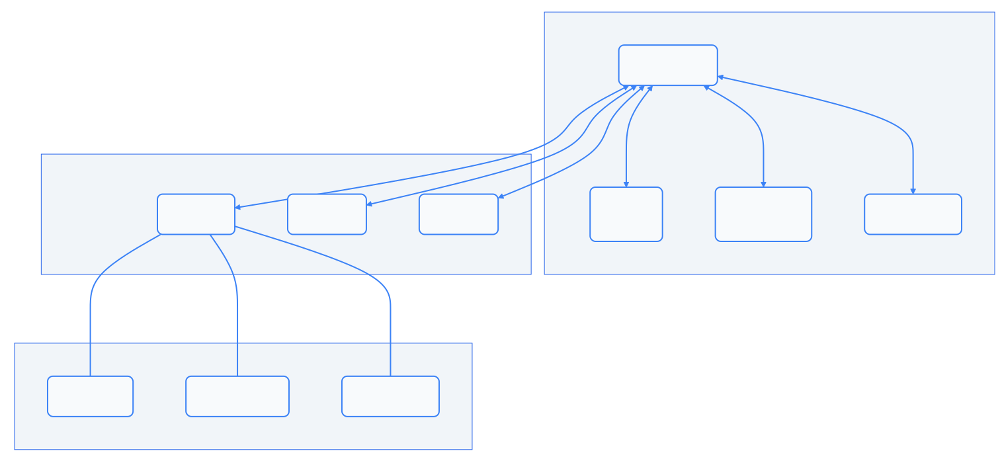
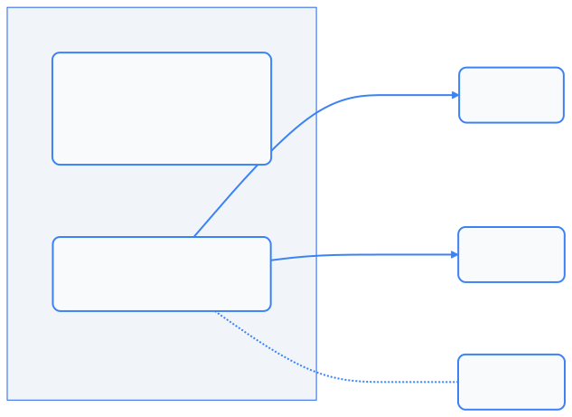
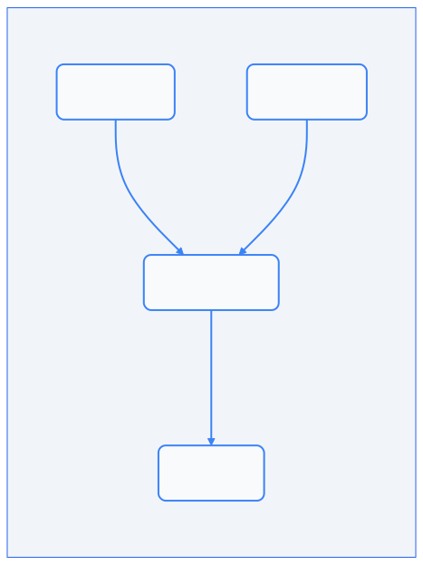

本文全面介绍 Kubernetes 的核心架构、对象模型、命名空间、对象管理与扩展机制等基础内容。若需深入了解存储、网络或工作负载管理等专题，请参考相关专章。

## Kubernetes 的前身 Borg

要谈到 Kubernetes 就要不得从 Borg 系统开始谈起。Borg 是 Google 内部运行超过 15 年的大规模集群管理系统，管理着数十万个应用跨越数千个集群。它为 Kubernetes 的设计提供了宝贵的实践经验和理论基础。


{width=572 height=549}

### Borg 核心组件

- **BorgMaster**：集群大脑，负责状态管理和决策制定，使用 Paxos 协议保证一致性
- **Scheduler**：智能调度器，基于资源需求和约束条件进行任务分配
- **Borglet**：节点代理，管理容器生命周期和资源监控
- **borgcfg**：声明式配置工具，定义应用的期望状态

## Kubernetes 架构总览

Kubernetes 采用分布式架构，控制面与工作节点分离，实现了决策集中与任务分布的高可用设计。

```mermaid "Kubernetes 架构总览"
flowchart TD
    subgraph "Control Plane"
        API["API Server"] 
        ETCD["etcd<br>存储"]
        CM["Controller<br>Manager"]
        SCH["Scheduler"]
    end

    subgraph "Worker Nodes"
        N1["节点 1"]
        N2["节点 2"]
        N3["节点 3"]
    end

    subgraph "Node Components"
        KB["kubelet"]
        KP["kube-proxy"]
        CRI["容器运行时"]
    end

    API <--> ETCD
    API <--> CM
    API <--> SCH
    
    API <--> N1
    API <--> N2
    API <--> N3
    
    N1 --- KB
    N1 --- KP
    N1 --- CRI
```


{width=1920 height=873}

## 控制面组件

控制面负责全局决策与事件响应，核心组件如下：



| 组件                    | 描述                 | 主要职责                 |
| ----------------------- | -------------------- | ------------------------ |
| kube-apiserver          | 控制面的前端入口     | 提供 API，处理所有请求   |
| etcd                    | 一致性高可用键值存储 | 存储集群所有数据         |
| kube-scheduler          | 监听新建 Pod         | 根据资源调度 Pod 到节点  |
| kube-controller-manager | 运行控制器进程       | 通过控制循环维护集群状态 |



## 节点组件

每个节点运行以下组件，负责 Pod 的实际运行与网络管理。

```mermaid "节点组件与 Pod 关系"
flowchart LR
    subgraph "Node"
        KB["kubelet"]
        KP["kube-proxy"]
        CR["容器运行时"]
        
        subgraph "Pods"
            P1["Pod 1"]
            P2["Pod 2"]
            P3["Pod 3"]
        end
    end
    
    KB --> CR
    CR --> Pods
    KP --> Pods
```


{width=1920 height=3275}



| 组件       | 描述         | 主要职责                                 |
| ---------- | ------------ | ---------------------------------------- |
| kubelet    | 节点代理     | 保证 Pod 中容器运行                      |
| kube-proxy | 网络代理     | 维护节点网络规则                         |
| 容器运行时 | 容器执行环境 | 运行容器（如 Docker、containerd、CRI-O） |



## Kubernetes API 与对象模型

Kubernetes API 定义了一组资源类型（对象），所有操作均通过 API Server 完成，负责对象的校验与配置。

### API 概念

```mermaid "Kubernetes API 请求流程"
flowchart TD
    C["客户端"] --> |请求| API["API Server"]
    API --> |读/写| ETCD["etcd"]
    API --> |响应| C
    API --> |校验| V["准入控制器"]
    API --> |认证| A["认证/鉴权"]
```


{width=1920 height=1506}

Kubernetes API 遵循 RESTful 设计：

- 资源通过 HTTP 动词（`GET`、`POST`、`PUT`、`DELETE`、`PATCH`）访问
- 资源按 API 组组织（如 `apps`、`batch`、`networking.k8s.io`）
- 对象包含 `metadata`、`spec`、`status` 等字段

### 对象的声明式管理

Kubernetes 对象是集群状态的持久实体，描述：

- 运行的容器化应用
- 可用资源
- 行为策略

每个对象有两个关键字段：

1. **`spec`**：用户声明的期望状态
2. **`status`**：Kubernetes 实际观测到的状态

### 对象命名与标识

每个对象通过以下标识唯一确定：



| 标识      | 描述             | 示例                                   |
| --------- | ---------------- | -------------------------------------- |
| Name      | 用户自定义名称   | `nginx-deployment`                     |
| UID       | 系统生成唯一标识 | `a8f3d1c8-0aeb-11e9-a4c2-000c29ed5138` |
| Namespace | 命名空间范围     | `default`、`kube-system`               |



命名空间内资源名称唯一，集群级资源全局唯一。

### 标签与选择器

标签（Label）是附加在对象上的键值对，用于组织和筛选对象。

```mermaid "标签与选择器示例"
flowchart LR
    subgraph "Pod Selection Example"
        L1["标签:
        app: nginx
        tier: frontend
        environment: production"]
        
        S1["选择器:
        app=nginx,tier=frontend"]
    end
    
    S1 --> |"选中"| P1["Pod 1"]
    S1 --> |"选中"| P2["Pod 2"]
    S1 -.- |"未选中"| P3["Pod 3"]
```


{width=1920 height=1396}

标签常用于：

- 服务选择 Pod
- 对象分组与组织
- 批量操作对象

### 字段选择器

字段选择器（Field Selector）可根据对象字段筛选资源，例如：

```bash
kubectl get pods --field-selector status.phase=Running
```



| 资源类型 | 支持字段                                                   |
| -------- | ---------------------------------------------------------- |
| Pod      | `status.phase`, `spec.nodeName`, `spec.serviceAccountName` |
| Node     | `spec.unschedulable`                                       |
| Event    | `involvedObject.kind`, `reason`, `type`                    |



## 命名空间与资源隔离

命名空间用于在单集群内隔离资源，适合多租户场景。

```mermaid "命名空间资源隔离示意"
flowchart TD
    subgraph "Kubernetes Cluster"
        subgraph "default namespace"
            D1["Deployment: app-1"]
            D2["Service: app-1-svc"]
        end
        
        subgraph "kube-system namespace"
            KD1["Deployment: kube-dns"]
            KD2["DaemonSet: kube-proxy"]
        end
        
        subgraph "team-a namespace"
            TD1["Deployment: app-2"]
            TD2["Service: app-2-svc"]
        end
    end
```


{width=1920 height=2204}

Kubernetes 默认包含四个命名空间：

- `default`：默认命名空间
- `kube-system`：系统组件
- `kube-public`：所有用户可读，公开资源
- `kube-node-lease`：节点心跳对象

## 对象所有权与垃圾回收

Kubernetes 通过 ownerReference 管理对象生命周期，实现级联删除。

```mermaid "对象所有权与级联删除"
flowchart TD
    D["Deployment"] --> |"owns"| RS["ReplicaSet"]
    RS --> |"owns"| P1["Pod 1"]
    RS --> |"owns"| P2["Pod 2"]
    RS --> |"owns"| P3["Pod 3"]
```


{width=1920 height=1629}

删除对象时可选择：

- **前台删除**：先删除依赖对象，再删除所有者
- **后台删除**：立即删除所有者，依赖对象后台清理
- **孤立删除**：仅删除所有者，保留依赖对象

## API Server 工作机制

API Server 是控制面的核心，负责所有组件间通信与 API 暴露。

### API Server 请求处理流程

```mermaid "API Server 请求处理流程"
flowchart TD
    subgraph "API Request Lifecycle"
        A["认证"] --> B["鉴权"]
        B --> C["准入控制"]
        C --> D["校验"]
        D --> E["etcd 存储"]
    end
```


{width=1920 height=277}

处理流程：

1. **认证**：校验客户端身份
2. **鉴权**：检查权限
3. **准入控制**：执行策略或修改对象
4. **校验**：结构合法性检查
5. **存储**：持久化到 etcd

### Server-Side Apply

Server-Side Apply 支持多客户端协作管理资源字段，自动冲突检测与合并。

```mermaid "Server-Side Apply 工作原理"
flowchart LR
    subgraph "Server-Side Apply"
        C1["客户端 1"] --> |"PATCH (字段 A,B)"| API
        C2["客户端 2"] --> |"PATCH (字段 C,D)"| API
        API["API Server"] --> |"存储合并对象"| ETCD
    end
```


{width=1920 height=2556}

主要特性：

- 跟踪字段归属
- 冲突自动检测与提示
- 支持控制器与人工协作

## Kubernetes 扩展机制

Kubernetes 支持多种扩展方式，无需修改核心代码即可适配不同场景。

```mermaid "Kubernetes 扩展点"
flowchart TD
    subgraph "Extension Points"
        API["API 扩展"] 
        ADM["准入控制器"]
        SCH["调度扩展"]
        AUTH["认证扩展"]
        CNI["网络插件"]
        CSI["存储插件"]
    end
```


{width=1920 height=5880}



| 扩展类型       | 作用                   | 示例                               |
| -------------- | ---------------------- | ---------------------------------- |
| 自定义资源     | 扩展 API 对象类型      | CRD、API 聚合                      |
| 准入 Webhook   | 拦截 API 请求校验/变更 | ValidatingWebhook、MutatingWebhook |
| 调度扩展       | 自定义 Pod 调度逻辑    | 调度插件、多调度器                 |
| 认证模块       | 新增认证方式           | OIDC、Webhook Token Auth           |
| 网络插件       | 实现 Pod 网络          | Calico、Cilium、Flannel            |
| 存储插件       | 支持多种存储系统       | CSI 插件                           |



## 日志与监控

Kubernetes 提供多种日志与监控能力，便于集群与应用的运维。

### 系统组件日志

各组件日志路径如下：



| 组件                    | Linux 路径                                                   | Windows 路径                                                 |
| ----------------------- | ------------------------------------------------------------ | ------------------------------------------------------------ |
| kube-apiserver          | `/var/log/kube-apiserver.log`                                | `C:\var\logs\kube-apiserver.log`                             |
| kube-scheduler          | `/var/log/kube-scheduler.log`                                | `C:\var\logs\kube-scheduler.log`                             |
| kube-controller-manager | `/var/log/kube-controller-manager.log`                       | `C:\var\logs\kube-controller-manager.log`                    |
| kubelet                 | `/var/log/kubelet.log`                                       | `C:\var\logs\kubelet.log`                                    |
| containers              | `/var/log/pods/<namespace>_<pod-name>_<uid>/<container-name>/` | `C:\var\log\pods\<namespace>_<pod-name>_<uid>\<container-name>\` |



### 指标采集

Kubernetes 组件通过 `/metrics` 端点暴露 Prometheus 格式指标。

```mermaid "Kubernetes 指标采集流程"
flowchart LR
    M["指标采集器"] --> |"抓取"| K1["/metrics API Server"]
    M --> |"抓取"| K2["/metrics Kubelet"]
    M --> |"抓取"| K3["/metrics Scheduler"]
    M --> |"抓取"| K4["/metrics Controller Manager"]
    M --> |"存储"| DB["指标数据库"]
    DB --> |"查询"| D["仪表盘"]
```


{width=1920 height=1465}

这些指标有助于集群健康与性能监控。

## 分布式追踪

Kubernetes 支持分布式追踪，便于跨组件操作的监控与故障排查。

```mermaid "Kubernetes 分布式追踪流程"
flowchart LR
    C["客户端"] --> |"请求"| API["API Server"]
    API --> |"追踪"| ETCD["etcd"]
    API --> |"追踪"| WH["Webhook"]
    
    COLLECTOR["OpenTelemetry Collector"] --> |"收集 Span"| API
    COLLECTOR --> |"收集 Span"| ETCD
    COLLECTOR --> |"导出"| BACKEND["追踪后端"]
```


{width=1920 height=735}

系统组件通过 OpenTelemetry 协议记录操作延迟与依赖关系。

## 分层架构

Kubernetes 采用分层架构设计，从底层基础设施到上层应用形成完整的技术栈。


{width=1898 height=1008}

下面是关于 Kubernetes 的架构层次的详细说明：

**基础设施层**：

- **计算**：虚拟机、物理机、云实例
- **网络**：SDN、负载均衡、防火墙
- **存储**：块存储、文件存储、对象存储

**容器运行时层**：

- **容器运行时**：containerd、CRI-O
- **镜像管理**：镜像仓库、镜像安全扫描
- **操作系统**：Linux、Windows Server

**Kubernetes 核心层**：

- **API Server**：统一的 API 入口
- **资源模型**：Pod、Service、Deployment 等
- **控制器**：声明式配置的实现机制
- **调度器**：资源分配和优化

**应用编排层**：

- **工作负载**：Deployment、StatefulSet、DaemonSet
- **配置管理**：ConfigMap、Secret
- **网络服务**：Service、Ingress、NetworkPolicy
- **存储编排**：PV、PVC、StorageClass

**扩展层**：

- **CRD**：自定义资源定义
- **Operator**：应用特定的运维逻辑
- **Admission Controller**：准入控制和策略执行
- **调度扩展**：自定义调度算法

**生态系统层**：

- **开发工具**：Helm、Kustomize、Skaffold
- **CI/CD**：Jenkins、GitLab CI、Tekton、ArgoCD
- **监控观测**：Prometheus、Grafana、Jaeger
- **安全工具**：Falco、OPA Gatekeeper、Twistlock
- **服务网格**：Istio、Linkerd、Consul Connect

## 总结

本文系统梳理了 Kubernetes 的核心架构、对象模型、命名空间、对象管理与扩展机制等基础内容。掌握这些核心概念，是高效使用和运维 Kubernetes 集群的前提。更多专题内容请参阅相关章节。

## 参考资料

- [Borg, Omega, and Kubernetes - ACM Queue](https://queue.acm.org/detail.cfm?id=2898444)
- [Large-scale cluster management at Google with Borg](https://research.google/pubs/pub43438/)
- [Kubernetes 官方文档 - kubernetes.io](https://kubernetes.io/docs/concepts/)
- [Kubernetes API 参考 - kubernetes.io](https://kubernetes.io/docs/reference/generated/kubernetes-api/)
- [Kubernetes 扩展机制 - kubernetes.io](https://kubernetes.io/docs/concepts/extend-kubernetes/)
