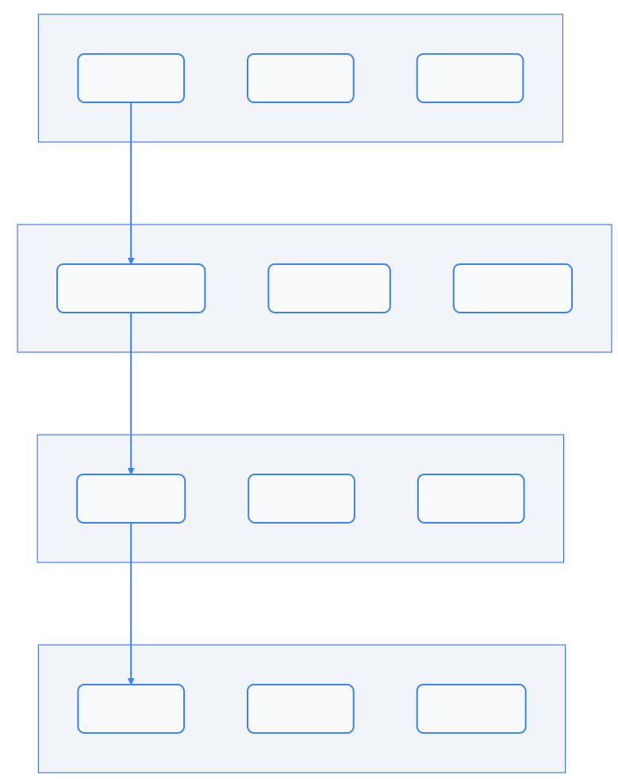

> 监控系统是 Kubernetes 可观测性体系的基础，通过多层次指标采集与分析，保障集群和应用的稳定运行与故障快速定位。

## 监控系统概述

在 Kubernetes 环境中，监控系统通过收集和分析各类指标，帮助运维团队实时掌握集群与应用状态。主流方案以 Prometheus 生态为核心，结合 Metrics Server 和自定义指标适配器，覆盖基础设施、平台、应用和业务层。

### 监控层次

下图展示了 Kubernetes 监控体系的分层结构及数据流转关系。

```mermaid "Kubernetes 监控层次结构"
graph TD
    subgraph "基础设施层"
        NODE[节点监控]
        CLUSTER[集群监控]
        NETWORK[网络监控]
    end

    subgraph "平台层"
        KUBERNETES[Kubernetes 组件]
        ETCD[etcd 数据库]
        API_SERVER[API Server]
    end

    subgraph "应用层"
        PODS[Pod 监控]
        SERVICES[服务监控]
        APPLICATIONS[应用指标]
    end

    subgraph "业务层"
        BUSINESS[业务指标]
        USER_EXP[用户体验]
        SLA[SLA 监控]
    end

    NODE --> KUBERNETES
    KUBERNETES --> PODS
    PODS --> BUSINESS
```


{width=1920 height=2420}

监控体系覆盖：

- 基础设施层：节点、集群、网络
- 平台层：Kubernetes 核心组件、etcd、API Server
- 应用层：Pod、服务、应用自定义指标
- 业务层：业务指标、用户体验、SLA

### 核心组件

监控系统主要由以下组件构成：

- Prometheus：时序数据库与指标采集系统
- Metrics Server：Kubernetes 基础资源指标收集
- 自定义指标适配器：扩展指标采集能力，支持 HPA、KEDA 等自动扩缩容

## Prometheus 监控系统

Prometheus 是云原生监控的事实标准，具备强大的数据模型和查询能力。

### 架构和工作原理

下图展示了 Prometheus 的核心架构及数据流转。

```mermaid "Prometheus 架构与数据流"
graph TD
    subgraph "数据收集"
        EXPORTERS[各种导出器]
        PUSHGATEWAY[推送网关]
        CLIENT_LIBS[客户端库]
    end

    subgraph "Prometheus 核心"
        PROMETHEUS_SERVER[Prometheus Server]
        TSDB[(时序数据库)]
        PROMQL[PromQL 查询引擎]
    end

    subgraph "数据消费"
        ALERTMANAGER[Alertmanager]
        GRAFANA[Grafana]
        HPA[HPA]
    end

    EXPORTERS --> PROMETHEUS_SERVER
    PUSHGATEWAY --> PROMETHEUS_SERVER
    CLIENT_LIBS --> PROMETHEUS_SERVER

    PROMETHEUS_SERVER --> TSDB
    PROMETHEUS_SERVER --> PROMQL

    PROMQL --> ALERTMANAGER
    PROMQL --> GRAFANA
    PROMQL --> HPA
```


{width=1920 height=2238}

核心特性：

- 多维度数据模型：指标名称与标签灵活组合
- 强大查询语言：PromQL 支持复杂时序分析
- 高效存储：本地时序数据库，支持远程扩展
- 自动发现：集成服务发现，自动采集目标
- 丰富生态：多种导出器与客户端库

### 部署配置

推荐使用 Helm 快速部署 Prometheus 及相关组件。

```bash
# 添加 Prometheus 仓库
helm repo add prometheus-community https://prometheus-community.github.io/helm-charts
helm repo update

# 安装 Prometheus
helm install prometheus prometheus-community/kube-prometheus-stack \
  --namespace monitoring \
  --create-namespace
```

基本配置示例：

```yaml
apiVersion: monitoring.coreos.com/v1
kind: Prometheus
metadata:
  name: prometheus
  namespace: monitoring
spec:
  replicas: 2
  retention: 30d
  securityContext:
    fsGroup: 2000
    runAsNonRoot: true
    runAsUser: 1000
  serviceAccountName: prometheus
  serviceMonitorSelector:
    matchLabels:
      team: backend
  ruleSelector:
    matchLabels:
      team: backend
      prometheus: prometheus
```

### PromQL 查询语言

PromQL 是 Prometheus 的核心查询语言，支持多种查询与聚合操作。

#### 基础查询

```promql
# 简单指标查询
http_requests_total

# 带标签选择器
http_requests_total{job="api-server", status="200"}

# 正则表达式匹配
http_requests_total{job=~"api-.*"}
```

#### 聚合操作

```promql
# 求和聚合
sum(http_requests_total)

# 按标签分组求和
sum by (method) (http_requests_total)

# 百分位数计算
histogram_quantile(0.95, rate(http_request_duration_bucket[10m]))
```

## Metrics Server

Metrics Server 是 Kubernetes 集群资源监控的基础组件，主要用于采集节点和 Pod 的 CPU、内存等指标。

### 功能和作用

- CPU 和内存指标采集
- 为 HPA（水平自动扩缩容）提供数据支持
- 轻量级设计，专注基础指标

### 部署和配置

推荐使用 Helm 安装 Metrics Server：

```bash
helm repo add metrics-server https://kubernetes-sigs.github.io/metrics-server/
helm repo update

helm install metrics-server metrics-server/metrics-server \
  --namespace kube-system \
  --set args="{--kubelet-insecure-tls,--kubelet-preferred-address-types=InternalIP}"
```

### 使用方法

常用命令如下：

```bash
# 查看节点资源使用情况
kubectl top nodes

# 查看 Pod 资源使用情况
kubectl top pods -n default

# 查看特定容器的资源使用
kubectl top pods --containers
```

## 自定义指标

Kubernetes 支持通过 Custom Metrics API 扩展指标采集能力，满足复杂自动化场景。

### 自定义指标 API

- Custom Metrics API:`/apis/custom.metrics.k8s.io/v1beta1`
- External Metrics API:`/apis/external.metrics.k8s.io/v1beta1`

### Prometheus Adapter

Prometheus Adapter 可将 Prometheus 指标暴露为 Kubernetes Custom Metrics API，供 HPA、KEDA 等组件使用。

```bash
# 安装 Prometheus Adapter
helm install prometheus-adapter prometheus-community/prometheus-adapter \
  --namespace monitoring \
  --set prometheus.url="http://prometheus-operated.monitoring.svc.cluster.local" \
  --set prometheus.port="9090"
```

配置规则示例：

```yaml
rules:
- seriesQuery: 'http_requests_total{namespace!="",pod!=""}'
  resources:
    overrides:
      namespace: {resource: "namespace"}
      pod: {resource: "pod"}
  name:
    matches: "^(.*)_total$"
    as: "${1}_per_second"
  metricsQuery: 'rate(<<.Series>>{<<.LabelMatchers>>}[5m])'
```

### KEDA 事件驱动扩缩容

KEDA 支持多种事件源自动扩缩容，适合异步任务和流式处理场景。

```yaml
apiVersion: keda.sh/v1alpha1
kind: ScaledObject
metadata:
  name: kafka-consumer-scaler
  namespace: default
spec:
  scaleTargetRef:
    name: kafka-consumer
  pollingInterval: 30
  cooldownPeriod: 300
  minReplicaCount: 0
  maxReplicaCount: 100
  triggers:
  - type: kafka
    metadata:
      bootstrapServers: kafka.svc.cluster.local:9092
      consumerGroup: my-consumer-group
      topic: orders
      lagThreshold: '10'
```

## 监控最佳实践

为保障监控系统的稳定性和可维护性，建议遵循以下最佳实践。

### 指标设计原则

- 命名规范：指标名称应简洁明了，标签表达业务语义

  ```promql
  # 推荐命名
  http_requests_total{method="GET", endpoint="/api/v1/users"}
  ```

- 标签使用：标签数量有限，避免高基数标签，标签值应为有限集合

### 性能优化

- 抓取间隔设置：不同类型指标设置合理采集频率

  ```yaml
  scrape_configs:
  - job_name: 'business-metrics'
    scrape_interval: 30s
  - job_name: 'system-metrics'
    scrape_interval: 60s
  ```

- 资源限制：为监控组件设置合理资源请求与限制

  ```yaml
  resources:
    requests:
      cpu: 1000m
      memory: 2Gi
    limits:
      cpu: 2000m
      memory: 4Gi
  ```

### 故障排除

- 指标收集失败：检查 Prometheus Pod 状态与日志

  ```bash
  kubectl get pods -n monitoring -l app=prometheus
  kubectl logs -n monitoring deployment/prometheus-server
  ```

- Metrics Server 问题：检查 Pod 状态与 API 服务

  ```bash
  kubectl get pods -n kube-system -l k8s-app=metrics-server
  kubectl get apiservice v1beta1.metrics.k8s.io
  ```

## 总结

监控系统是 Kubernetes 可观测性的基础。通过 Prometheus、Metrics Server 和自定义指标适配器，可以构建覆盖基础设施到业务层的完整监控体系。合理设计指标、优化性能、完善告警与自动扩缩容机制，是保障集群稳定与业务连续性的关键。

## 参考文献

1. [Prometheus 官方文档 - prometheus.io](https://prometheus.io/docs/introduction/overview/)
2. [Kube-Prometheus-Stack Helm Chart - prometheus-community.github.io](https://github.com/prometheus-community/helm-charts/tree/main/charts/kube-prometheus-stack)
3. [Metrics Server 官方文档 - kubernetes-sigs.github.io](https://github.com/kubernetes-sigs/metrics-server)
4. [KEDA 官方文档 - keda.sh](https://keda.sh/docs/)
5. [Prometheus Adapter 官方文档 - prometheus-operator.dev](https://prometheus-operator.dev/docs/user-guides/prometheus-adapter/)
