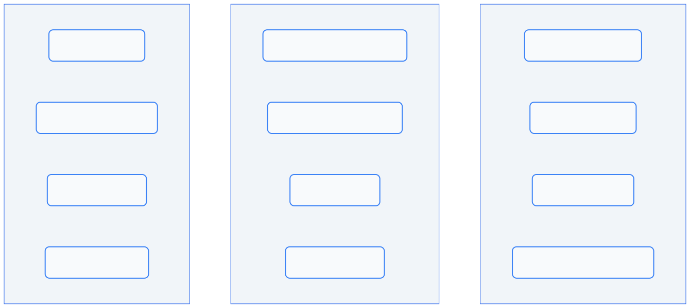

> 可观测性是云原生系统稳定性和高效运维的基石，通过指标、日志和链路追踪等手段，帮助团队全面洞察 Kubernetes 集群与应用的运行状态，实现快速故障定位与性能优化。

## 什么是可观测性？

可观测性（Observability）指通过外部输出推断系统内部状态的能力。在云原生环境中，可观测性帮助我们理解分布式系统的行为，快速诊断问题并优化性能。

### 可观测性的三个支柱

下图展示了可观测性的三大核心支柱及其作用。

```mermaid "可观测性三支柱"
graph TD
    A[可观测性三支柱] --> B[Metrics 指标]
    A --> C[Logs 日志]
    A --> D[Traces 链路追踪]

    B --> B1[系统性能监控]
    B --> B2[资源使用情况]
    B --> B3[业务指标]

    C --> C1[应用日志]
    C --> C2[系统日志]
    C --> C3[审计日志]

    D --> D1[请求链路跟踪]
    D --> D2[性能瓶颈分析]
    D --> D3[错误定位]
```


{width=1981 height=417}

#### Metrics（指标）

- 系统指标：CPU、内存、磁盘、网络使用率
- 应用指标：响应时间、错误率、吞吐量
- 业务指标：用户活跃度、订单量、转化率

#### Logs（日志）

- 应用日志：业务逻辑执行记录
- 系统日志：操作系统和中间件日志
- 审计日志：安全和合规相关记录

#### Traces（链路追踪）

- 分布式追踪：跨服务请求跟踪
- 性能分析：识别瓶颈和延迟源
- 错误关联：连接相关事件和错误

## Kubernetes 可观测性架构

Kubernetes 提供了丰富的可观测性原语和集成点。下图展示了各层组件与数据流动关系。

```mermaid "Kubernetes 可观测性架构"
graph TD
    subgraph "Kubernetes 控制面"
        API[API Server]
        ETCD[etcd]
        SCHEDULER[Scheduler]
        CONTROLLER[Controller Manager]
    end

    subgraph "工作节点"
        KUBELET[Kubelet]
        CONTAINERD[Container Runtime]
        CNI[CNI Plugin]
    end

    subgraph "可观测性层"
        PROMETHEUS[Prometheus]
        GRAFANA[Grafana]
        LOKI[Loki]
        TEMPO[Tempo]
    end

    subgraph "数据流"
        METRICS[(Metrics)]
        LOGS[(Logs)]
        TRACES[(Traces)]
    end

    API --> METRICS
    KUBELET --> METRICS
    CONTAINERD --> LOGS
    SCHEDULER --> TRACES

    PROMETHEUS --> METRICS
    GRAFANA --> PROMETHEUS
    LOKI --> LOGS
    TEMPO --> TRACES
```


{width=2417 height=674}

### Kubernetes 原生可观测性

Kubernetes 提供了多种原生 API，便于基础观测和故障排查。

#### Metrics API

通过 Metrics API 可获取节点和 Pod 的资源指标：

```bash
# 查看节点指标
kubectl top nodes

# 查看 Pod 指标
kubectl top pods
```

#### Events API

Events API 记录集群中的重要事件，便于追踪变更和异常：

```bash
# 查看集群事件
kubectl get events --sort-by=.metadata.creationTimestamp

# 查看特定命名空间的事件
kubectl get events -n kube-system
```

#### Logs API

通过 kubectl logs 命令访问容器日志，支持实时流式查看：

```bash
# 查看 Pod 日志
kubectl logs <pod-name>

# 查看多容器 Pod 的特定容器日志
kubectl logs <pod-name> -c <container-name>

# 实时查看日志
kubectl logs -f <pod-name>
```

## 可观测性最佳实践

为实现高效的观测体系，建议分层设计、标准化指标与日志、合理采样链路追踪。

### 分层观测策略

下图展示了可观测性分层策略，从基础设施到业务层逐步覆盖。

```mermaid "分层观测策略"
graph TD
    subgraph "基础设施层"
        INFRA[物理机/虚拟机指标]
        NETWORK[网络设备监控]
        STORAGE[存储系统监控]
    end

    subgraph "平台层"
        K8S[Kubernetes 集群监控]
        ETCD[etcd 监控]
        NETWORK_P[K8s 网络监控]
    end

    subgraph "应用层"
        APP[应用性能监控]
        BUSINESS[业务指标监控]
        USER[用户体验监控]
    end

    subgraph "业务层"
        SLA[SLA 监控]
        REVENUE[营收指标]
        CUSTOMER[客户满意度]
    end

    INFRA --> PLATFORM
    PLATFORM --> APPLICATION
    APPLICATION --> BUSINESS
```


{width=1920 height=1448}

### 指标层次结构

- 基础设施指标：CPU、内存、磁盘、网络
- 系统指标：Kubernetes 组件状态、etcd 性能
- 应用指标：响应时间、错误率、吞吐量
- 业务指标：用户行为、业务流程完成率

### 日志聚合策略

- 结构化日志：推荐使用 JSON 格式，便于查询和分析
- 日志级别管理：ERROR、WARN、INFO、DEBUG 分层
- 日志轮转：避免磁盘空间耗尽
- 集中存储：使用 Elasticsearch 或 Loki 进行日志聚合

### 链路追踪实施

- 采样策略：生产环境使用适当采样率，平衡性能与可见性
- 上下文传播：确保 trace ID 在服务间正确传递
- 错误关联：将异常与具体请求关联，便于定位问题

## 常用可观测性工具栈

Kubernetes 可观测性生态丰富，CNCF 毕业和孵化项目为主流选择。

```mermaid "CNCF 可观测性项目"
graph TD
    subgraph "CNCF Graduated"
        PROMETHEUS[Prometheus - 指标收集]
        JAEGER[Jaeger - 分布式追踪]
        FLUENTD[Fluentd - 日志收集]
        OPENTELEMETRY[OpenTelemetry - 可观测性标准]
    end

    subgraph "CNCF Incubating"
        THanos[Thanos - Prometheus 长时存储]
        Cortex[Cortex - 可扩展 Prometheus]
        LOKI[Loki - 日志聚合]
        TEMPO[Tempo - 追踪存储]
    end

    subgraph "第三方工具"
        GRAFANA[Grafana - 可视化]
        ELASTICSEARCH[Elasticsearch - 日志存储]
        KIBANA[Kibana - 日志查询]
        SKYWALKING[SkyWalking - APM]
    end
```


{width=1920 height=859}

### 推荐工具组合

- 指标监控：Prometheus + Grafana
- 日志管理：EFK（Elasticsearch + Fluentd + Kibana）或 PLG（Promtail + Loki + Grafana）
- 链路追踪：Jaeger 或 SkyWalking

## 实施指南

可观测性体系建设建议分阶段推进，确保覆盖全面且易于运维。

### 规划阶段

- 需求分析：明确需观测的组件和指标
- 工具选型：结合团队技能和现有基础设施选择合适工具
- 资源规划：评估存储和计算资源需求

### 部署阶段

- 基础设施准备：配置存储和网络
- 工具安装：按最佳实践部署可观测性栈
- 集成配置：完善数据收集与处理管道

### 运维阶段

- 监控监控系统：确保观测系统自身可用
- 告警配置：合理设置告警阈值和通知渠道
- 性能优化：定期审查和优化数据收集策略

### 持续改进

- 指标审查：定期评估指标有效性和完整性
- 工具升级：保持可观测性工具的更新
- 流程优化：基于观测数据持续改进开发与运维流程

## 总结

可观测性是确保 Kubernetes 集群和应用稳定运行的关键。通过合理设计和实施可观测性策略，结合强大的工具栈，团队可以实现对系统的全面了解，快速响应问题，并持续优化性能和用户体验。

## 参考文献

1. [Prometheus 官方文档 - prometheus.io](https://prometheus.io/docs/introduction/overview/)
2. [Kubernetes 官方文档 - kubernetes.io](https://kubernetes.io/docs/)
3. [OpenTelemetry 官方文档 - opentelemetry.io](https://opentelemetry.io/)
4. [Grafana 官方文档 - grafana.com](https://grafana.com/docs/)
5. [Jaeger 官方文档 - jaegertracing.io](https://www.jaegertracing.io/docs/)
