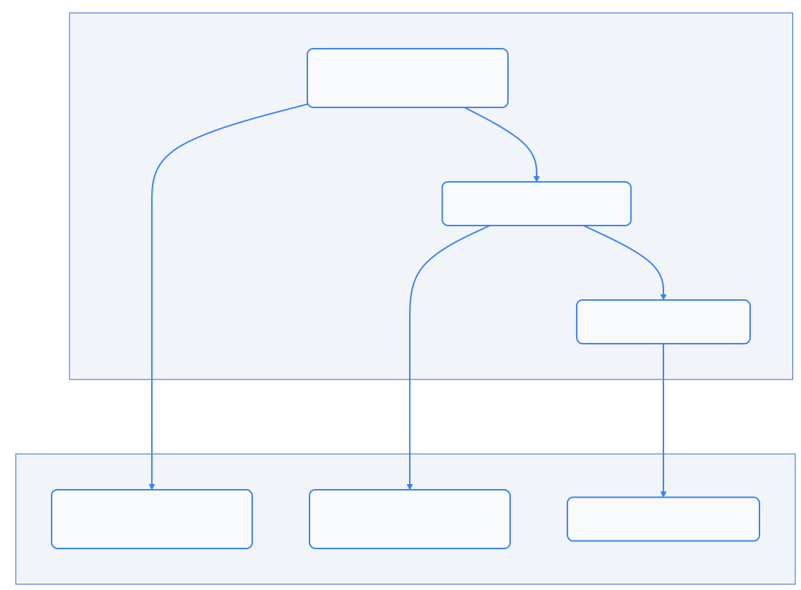

Kubernetes 版本发布管理系统负责版本规划、发布执行与支持保障。本文详解发布周期、角色分工、流程与策略，助力稳定可靠地交付 Kubernetes 版本。

## 发布周期概览

Kubernetes 遵循结构化的发布周期，每年约发布三次，每个周期约 14 周，分为三个主要阶段。

### 发布周期阶段

下图展示了发布流程与关键里程碑：

```mermaid "发布流程与关键里程碑"
flowchart TB
    subgraph A["发布流程（Release Process）"]
        A1["功能定义（Enhancement Definition）"]
        A2["实现阶段（Implementation）"]
        A3["稳定阶段（Stabilization）"]
        A1 --> A2
        A2 --> A3
    end

    subgraph B["关键里程碑（Key Milestones）"]
        B1["功能冻结（Enhancements Freeze，第4周）"]
        B2["代码冻结（Code Freeze，第12-14周）"]
        B3["正式发布（Release，第14周）"]
    end

    A1 --> B1
    A2 --> B2
    A3 --> B3
```

{width=1920 height=1415}

- **功能定义**：确定本周期计划纳入的特性，约第 4 周前完成增强提案（Enhancements Freeze）。
- **实现阶段**：主要开发、集成测试与文档完善。
- **稳定阶段**：聚焦稳定性，约第 12 周进入代码冻结（Code Freeze），仅接受关键修复，最终发布。

发布后，master 分支重新开放，当前版本的修改通过 cherry-pick 回补到 release 分支。

## 发布规划与里程碑管理

版本规划涉及特性负责人、SIG 领导与 Release Team。增强提案需在前 4 周内准备完毕。

```mermaid "发布规划与里程碑管理"
flowchart LR
    subgraph A["必需标签（Required Labels）"]
        A1["SIG 负责人标签"]
        A2["Issue/PR 类型"]
        A3["优先级标签"]
        A4["里程碑（Milestone）"]
    end

    subgraph B["版本规划（Release Planning）"]
        B1["Kubernetes 改进提案（KEPs）"]
        B2["GitHub 里程碑创建"]
        B3["SIG 规划与审批"]
    end

    subgraph C["问题与PR跟踪（Issue and PR Tracking）"]
        C1["增强功能问题（Enhancement Issues）"]
        C2["缺陷/特性问题（Bug/Feature Issues）"]
        C3["拉取请求（Pull Requests）"]
    end

    B1 --> C1
    B3 --> C1
    B3 --> C2
    C1 --> C3
    C2 --> C3
    C3 --> A
```

{width=2410 height=492}

每个面向发布的 Issue 或 PR 需包含：

- **SIG Owner 标签**：标明责任 SIG
- **优先级标签**：如 `priority/critical-urgent`、`priority/important-soon`
- **Kind 标签**：如 `kind/bug`、`kind/feature`
- **Milestone**：目标发布版本

代码冻结期间，仅接受带有特定标签（如 `kind/bug`、`kind/failing-test`）和正确里程碑的 PR。

## 版本号与语义化管理

Kubernetes 采用语义化版本（SemVer）格式 **x.y.z**：

- **x**：主版本号
- **y**：次版本号
- **z**：补丁号

如 1.28.3 表示主版本 1，次版本 28，补丁 3。

## 版本支持周期

Kubernetes 维护最近三个小版本的 release 分支。1.19 及以上版本约有 1 年补丁支持，1.18 及以下为 9 个月。

```mermaid "版本支持生命周期"
flowchart LR
    A["标准支持期（12 个月）"] --> B["维护模式（2 个月）"]
    B --> C["生命周期结束（EOL）"]

    subgraph "维护模式活动"
        D["安全漏洞修复（CVE）"]
        E["依赖项问题修复"]
        F["关键核心组件问题修复"]
    end

    B --> D
    B --> E
    B --> F
```

{width=1920 height=1127}

- **标准支持期**：前 12 个月，常规补丁与安全更新
- **维护模式**：最后 2 个月，仅修复安全漏洞、依赖项与核心组件关键问题
- **生命周期结束（EOL）**：维护期后版本不再支持

## 补丁发布流程

### 发布节奏与计划

补丁版本通常每月发布，次版本发布初期补丁节奏更快（1-2 周）。遇关键 bug 可临时加发。

补丁发布时间表维护于 `schedule.yaml`，并在补丁发布页面展示。

### Cherry Pick 流程

补丁合入需满足：

1. GitHub PR 已通过 `approved`、`lgtm`、`release-note` 等标签
2. Cherry pick 截止前（一般为目标发布前两天）通过 CI
3. 遵循 [cherry pick 流程](https://github.com/kubernetes/website/blob/4c26fe55/cherry%20pick%20process)

不满足条件的 PR 顺延至下次补丁发布。

## 发布管理角色分工

Kubernetes 发布管理体系包含多种角色，各司其职。

### Release Managers

主要职责：

- 协调并发布各类版本（补丁、小版本、预发布）
- 维护 release 分支，审核 cherry pick，保障分支健康
- 指导 Release Manager Associate
- 维护 k/release 代码库
- 支持 Release Team 各阶段工作

### Release Manager Associates

作为 Release Manager 学徒，主要参与：

- 补丁发布与 cherry pick 审核
- 贡献 k/release 代码
- 维护发布流程文档
- 协助 Release Team 与新成员培养

### SIG Release 领导

SIG Release Chairs 与技术负责人负责：

- SIG Release 治理
- 组织知识交流与领导力培训
- 管理沟通渠道与权限组

## 版本偏差策略（Version Skew Policy）

版本偏差策略定义各组件间最大支持的版本差异，核心规则如下：

1. **kube-apiserver**：HA 集群中新旧 apiserver 版本差异不超过 1 个小版本
2. **kubelet**：不得高于 apiserver，最多可比 apiserver 低 3 个小版本
3. **kube-proxy**：不得高于 apiserver，可比 apiserver 低 3 个小版本，也可与本节点 kubelet 相差 3 个小版本
4. **kube-controller-manager、kube-scheduler、cloud-controller-manager**：不得高于 apiserver，建议与 apiserver 保持一致，最多低 1 个小版本
5. **kubectl**：支持与 apiserver 相差 1 个小版本（高/低均可）

## 组件升级顺序

升级时应遵循如下顺序：

1. **kube-apiserver**（优先升级，确保不落后于其他组件）
2. **kube-controller-manager、kube-scheduler、cloud-controller-manager**（顺序不限，可同时升级）
3. **kubelet**（可选，允许滞后于 apiserver）
4. **kube-proxy**（可选，允许滞后于 apiserver）

## 安全发布管理

Release Management 团队与 Security Response Committee 紧密协作，安全相关发布遵循专门流程：

- **安全发布流程**：严格遵循安全响应委员会指导
- **信息禁运政策**：部分安全信息按政策禁运
- **安全公告**：通过 kubernetes-security-announce 群组发布

团队内部设有私有邮件列表与 Slack 频道，便于安全事件协调。

## 发布制品与验证

每次发布会产出多种制品，均需签名验证。下图展示了发布周期与支持关系：

```mermaid "Kubernetes 版本发布与支持周期"
flowchart LR
    subgraph "Minor Release Cycle (3-4 months)"
        alpha["Alpha Releases
        (Feature Development)"]
        beta["Beta Releases
        (Feature Stabilization)"]
        rc["Release Candidates
        (Final Testing)"]
        ga["General Availability
        (Production Release)"]
    end

    subgraph "Support Timeline"
        support["Standard Support
        (12 months)"]
        maintenance["Maintenance Mode
        (2 months)"]
        eol["End-of-Life"]
    end

    subgraph "Patch Releases"
        monthly["Monthly Patches
        (Bug Fixes, Security Updates)"]
    end

    alpha --> beta
    beta --> rc
    rc --> ga
    ga --> support
    support --> maintenance
    maintenance --> eol

    monthly -.-> support
    monthly -.-> maintenance
```

{width=2456 height=431}

**二进制与镜像签名**：采用 [sigstore](https://sigstore.dev) 签名，可用 `cosign` 工具验证

- 二进制验证：`cosign verify-blob`
- 镜像验证：`cosign verify`
- SBOM 验证：签名或 SHA 校验

## Release Team 与治理

Release Team 独立于 Release Managers，每个发布周期组建，设有 Enhancements Lead、Bug Triage Lead 等专职角色。

GitHub 里程碑由 `milestone-maintainers` 团队维护，涵盖各 SIG 代表。

最终治理归 SIG Release 领导团队负责。

## 总结

Kubernetes 版本发布管理体系通过规范的流程、角色分工与安全策略，保障了版本交付的稳定性与可追溯性。理解发布周期、支持策略与升级顺序，有助于企业和开发者安全高效地管理集群版本。

## 参考文献

1. [Release Cycle 详细文档 - github.com](https://github.com/kubernetes/website/blob/4c26fe55/Release%20Cycle%20detailed%20documentation)
2. [Patch Releases 文档 - github.com](https://github.com/kubernetes/website/blob/4c26fe55/Patch%20Releases%20documentation)
3. [Version Skew Policy - github.com](https://github.com/kubernetes/website/blob/4c26fe55/Version%20Skew%20Policy)
4. [Kubernetes Security 信息 - github.com](https://github.com/kubernetes/website/blob/4c26fe55/Kubernetes%20Security%20information)
5. [Release Manager 联系方式 - github.com](https://github.com/kubernetes/website/blob/4c26fe55/Release%20Manager%20contact%20information)
