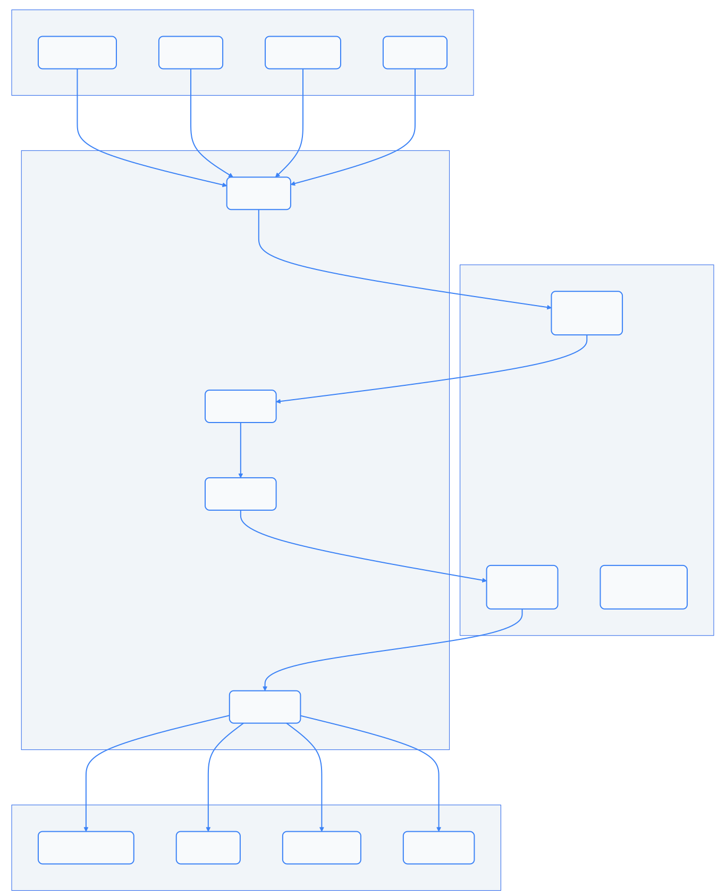
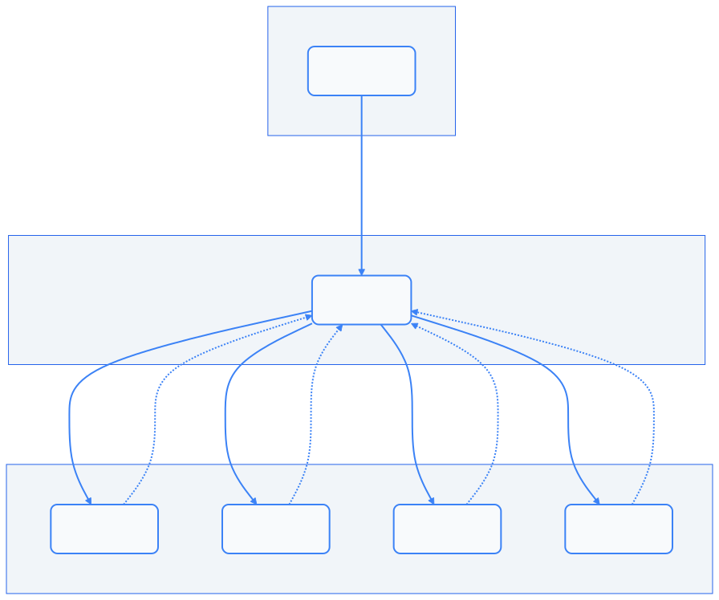

> Knative Eventing 为 Kubernetes 提供了标准化、松耦合的事件驱动架构，支持多种事件源、灵活的事件处理模式和高可扩展性，是构建现代云原生事件系统的关键组件。

## Knative Eventing 概述

Knative Eventing 是 Knative 的核心组件之一，提供事件驱动架构的支持。它允许应用以松耦合的方式进行通信，支持多种事件源和事件处理模式，极大提升了系统的灵活性和可维护性。

## 核心概念

在 Knative Eventing 中，事件驱动架构通过标准化事件流转，实现了生产者与消费者的解耦。

### 事件驱动架构

下图展示了 Knative Eventing 的事件流转过程及核心组件。

```mermaid "事件驱动架构"
graph TD
    subgraph "事件生产者"
        PRODUCER["生产者应用"]
        SENSOR["传感器"]
        WEBHOOK["Webhook"]
        TIMER["定时器"]
    end

    subgraph "事件基础设施"
        BROKER["Broker<br/>事件代理"]
        CHANNEL["Channel<br/>事件通道"]
        SUBSCRIPTION["Subscription<br/>订阅"]
    end

    subgraph "事件消费者"
        FUNCTION["Serverless 函数"]
        SERVICE["微服务"]
        BATCH_JOB["批处理作业"]
        EXTERNAL["外部系统"]
    end

    subgraph "事件流"
        SOURCE["事件源"]
        FILTER["事件过滤"]
        TRANSFORM["事件转换"]
        DELIVERY["事件投递"]
    end

    PRODUCER --> SOURCE
    SENSOR --> SOURCE
    WEBHOOK --> SOURCE
    TIMER --> SOURCE

    SOURCE --> BROKER
    BROKER --> FILTER
    FILTER --> TRANSFORM
    TRANSFORM --> CHANNEL
    CHANNEL --> DELIVERY
    DELIVERY --> FUNCTION
    DELIVERY --> SERVICE
    DELIVERY --> BATCH_JOB
    DELIVERY --> EXTERNAL
```


{width=1920 height=2391}

### CloudEvents 标准

Knative Eventing 完全兼容 CloudEvents 规范，便于事件在不同系统间传递。

```json
{
  "specversion": "1.0",
  "type": "com.example.order.created",
  "source": "/orders",
  "subject": "order-12345",
  "id": "1234567890",
  "time": "2023-10-19T10:30:00Z",
  "datacontenttype": "application/json",
  "data": {
    "orderId": "12345",
    "customerId": "67890",
    "amount": 99.99
  }
}
```

## 核心组件

Knative Eventing 主要由 Broker、Trigger 和 Source 组成，分别负责事件的接收、分发和采集。

### Broker（事件代理）

Broker 是事件的中央集线器，负责接收和分发事件。

```yaml
apiVersion: eventing.knative.dev/v1
kind: Broker
metadata:
  name: default
  namespace: default
spec:
  config:
    apiVersion: v1
    kind: ConfigMap
    name: config-br-default-channel
    namespace: knative-eventing
  delivery:
    retry: 3
    backoffDelay: "200ms"
    backoffPolicy: exponential
```

### Trigger（触发器）

Trigger 定义如何过滤和路由事件到订阅者。

```yaml
apiVersion: eventing.knative.dev/v1
kind: Trigger
metadata:
  name: order-processing-trigger
  namespace: default
spec:
  broker: default
  filter:
    attributes:
      type: com.example.order.created
      source: /orders
  subscriber:
    ref:
      apiVersion: serving.knative.dev/v1
      kind: Service
      name: order-processor
    uri: /process
  delivery:
    retry: 5
    backoffDelay: "1s"
    backoffPolicy: linear
```

### Source（事件源）

Source 负责从外部系统采集事件，支持多种类型。

#### HTTP Source

```yaml
apiVersion: sources.knative.dev/v1
kind: HttpSource
metadata:
  name: http-source
  namespace: default
spec:
  sink:
    ref:
      apiVersion: serving.knative.dev/v1
      kind: Broker
      name: default
  path: /webhook
```

#### Kafka Source

```yaml
apiVersion: sources.knative.dev/v1
kind: KafkaSource
metadata:
  name: kafka-source
  namespace: default
spec:
  consumerGroup: knative-group
  bootstrapServers:
  - my-cluster-kafka-bootstrap.kafka:9092
  topics:
  - orders
  - payments
  sink:
    ref:
      apiVersion: serving.knative.dev/v1
      kind: Broker
      name: default
```

#### GitHub Source

```yaml
apiVersion: sources.knative.dev/v1
kind: GitHubSource
metadata:
  name: github-source
  namespace: default
spec:
  eventTypes:
  - push
  - pull_request
  ownerAndRepository: myorg/myrepo
  accessToken:
    secretKeyRef:
      name: github-secret
      key: accessToken
  secretToken:
    secretKeyRef:
      name: github-secret
      key: secretToken
  sink:
    ref:
      apiVersion: serving.knative.dev/v1
      kind: Broker
      name: default
```

#### Ping Source（定时器）

```yaml
apiVersion: sources.knative.dev/v1
kind: PingSource
metadata:
  name: heartbeat-source
  namespace: default
spec:
  schedule: "*/5 * * * *"  # 每 5 分钟
  data: '{"message": "heartbeat", "timestamp": "2023-10-19T10:30:00Z"}'
  sink:
    ref:
      apiVersion: serving.knative.dev/v1
      kind: Broker
      name: default
```

## 事件处理模式

Knative Eventing 支持多种事件处理模式，满足不同业务场景需求。

### 发布 - 订阅模式

下图展示了典型的发布 - 订阅事件分发流程。

```mermaid "发布-订阅模式"
graph TD
    subgraph "发布者"
        PRODUCER["订单服务"]
    end

    subgraph "代理"
        BROKER["Broker"]
    end

    subgraph "订阅者"
        EMAIL["邮件服务"]
        INVENTORY["库存服务"]
        BILLING["计费服务"]
        ANALYTICS["分析服务"]
    end

    PRODUCER -->|"发布事件"| BROKER
    BROKER -->|"分发事件"| EMAIL
    BROKER -->|"分发事件"| INVENTORY
    BROKER -->|"分发事件"| BILLING
    BROKER -->|"分发事件"| ANALYTICS

    EMAIL -.->|"Trigger 1"| BROKER
    INVENTORY -.->|"Trigger 2"| BROKER
    BILLING -.->|"Trigger 3"| BROKER
    ANALYTICS -.->|"Trigger 4"| BROKER
```


{width=1920 height=1603}

### 序列处理

通过 Sequence 资源实现事件的串行处理。

```yaml
apiVersion: flows.knative.dev/v1
kind: Sequence
metadata:
  name: order-processing-sequence
  namespace: default
spec:
  channelTemplate:
    apiVersion: messaging.knative.dev/v1
    kind: InMemoryChannel
  steps:
  - ref:
      apiVersion: serving.knative.dev/v1
      kind: Service
      name: order-validator
  - ref:
      apiVersion: serving.knative.dev/v1
      kind: Service
      name: inventory-checker
  - ref:
      apiVersion: serving.knative.dev/v1
      kind: Service
      name: payment-processor
  - ref:
      apiVersion: serving.knative.dev/v1
      kind: Service
      name: order-fulfillment
  reply:
    ref:
      apiVersion: serving.knative.dev/v1
      kind: Service
      name: order-confirmation
```

### 并行处理

通过 Parallel 资源实现事件的并行分发和处理。

```yaml
apiVersion: flows.knative.dev/v1
kind: Parallel
metadata:
  name: order-processing-parallel
  namespace: default
spec:
  channelTemplate:
    apiVersion: messaging.knative.dev/v1
    kind: InMemoryChannel
  branches:
  - filter:
      attributes:
        type: order.created
    subscriber:
      ref:
        apiVersion: serving.knative.dev/v1
        kind: Service
        name: email-notification
  - filter:
      attributes:
        type: order.created
    subscriber:
      ref:
        apiVersion: serving.knative.dev/v1
        kind: Service
        name: inventory-update
  - filter:
      attributes:
        type: order.created
    subscriber:
      ref:
        apiVersion: serving.knative.dev/v1
        kind: Service
        name: analytics-tracking
```

## 高级特性

Knative Eventing 提供丰富的高级特性，支持复杂事件处理需求。

### 事件过滤

通过 Trigger 支持多维度事件过滤和 CEL 表达式。

```yaml
apiVersion: eventing.knative.dev/v1
kind: Trigger
metadata:
  name: filtered-trigger
spec:
  broker: default
  filter:
    attributes:
      type: com.example.order.created
      customer.tier: premium
    celFilter: "data.amount > 1000"
  subscriber:
    ref:
      apiVersion: serving.knative.dev/v1
      kind: Service
      name: premium-order-handler
```

### 事件转换

支持事件内容和元数据的转换与增强。

```yaml
apiVersion: eventing.knative.dev/v1
kind: Trigger
metadata:
  name: transform-trigger
spec:
  broker: default
  filter:
    attributes:
      type: order.created
  subscriber:
    ref:
      apiVersion: serving.knative.dev/v1
      kind: Service
      name: order-transformer
  delivery:
    options:
      specversion: "1.0"
      type: "order.processed"
      source: "/order-transformer"
```

### 死信队列

通过 deadLetterSink 配置支持事件投递失败后的兜底处理。

```yaml
apiVersion: eventing.knative.dev/v1
kind: Trigger
metadata:
  name: trigger-with-dlq
spec:
  broker: default
  delivery:
    deadLetterSink:
      ref:
        apiVersion: serving.knative.dev/v1
        kind: Service
        name: dead-letter-handler
    retry: 5
    backoffDelay: "1s"
    backoffPolicy: exponential
```

## 与 Knative Serving 集成

Knative Eventing 可与 Knative Serving 无缝集成，实现事件驱动的函数调用和自动扩缩容。

### 事件驱动的函数调用

以下示例展示了事件驱动的函数调用流程。

```yaml
# 创建 Broker
apiVersion: eventing.knative.dev/v1
kind: Broker
metadata:
  name: default
  namespace: default

---
# 创建 Knative Service
apiVersion: serving.knative.dev/v1
kind: Service
metadata:
  name: event-consumer
  namespace: default
spec:
  template:
    spec:
      containers:
      - image: gcr.io/knative-samples/helloworld-go
        env:
        - name: MESSAGE
          value: "Event received!"

---
# 创建 Trigger
apiVersion: eventing.knative.dev/v1
kind: Trigger
metadata:
  name: event-consumer-trigger
  namespace: default
spec:
  broker: default
  filter:
    attributes:
      type: dev.knative.samples.helloworld
  subscriber:
    ref:
      apiVersion: serving.knative.dev/v1
      kind: Service
      name: event-consumer
```

### 自动扩缩容集成

通过 Serving 注解实现事件驱动的自动扩缩容。

```yaml
apiVersion: serving.knative.dev/v1
kind: Service
metadata:
  name: event-consumer
spec:
  template:
    metadata:
      annotations:
        # 事件驱动扩缩容
        autoscaling.knative.dev/metric: "concurrency"
        autoscaling.knative.dev/target: "10"
        autoscaling.knative.dev/minScale: "0"
        autoscaling.knative.dev/maxScale: "100"
    spec:
      containers:
      - image: event-consumer:latest
```

## 监控和调试

Knative Eventing 提供丰富的监控和调试手段，便于事件流追踪和故障排查。

### 事件流监控

可通过以下命令监控事件流和组件状态。

```bash
# 查看 Broker 状态
kubectl get broker

# 查看 Trigger 状态
kubectl get trigger

# 查看事件源状态
kubectl get source

# 查看事件流
kubectl get eventtypes
```

### 调试事件

常用调试方法如下：

```bash
# 查看 Broker 日志
kubectl logs -n knative-eventing deployment/eventing-controller

# 查看事件投递状态
kubectl describe trigger <trigger-name>

# 测试事件发送
curl -X POST http://broker-ingress-url \
  -H "Content-Type: application/cloudevents+json" \
  -d '{
    "specversion": "1.0",
    "type": "test.event",
    "source": "/test",
    "id": "1234567890"
  }'
```

### 指标监控

可通过 Prometheus 集成采集事件相关指标。

```yaml
# Prometheus ServiceMonitor
apiVersion: monitoring.coreos.com/v1
kind: ServiceMonitor
metadata:
  name: knative-eventing
  namespace: monitoring
spec:
  selector:
    matchLabels:
      app.kubernetes.io/name: knative-eventing
  endpoints:
  - port: http-metrics
    path: /metrics
    interval: 30s
```

## 故障排除

常见问题及调试技巧，帮助快速定位和解决问题。

### 常见问题

1. **事件无法投递**

   ```bash
   # 检查 Broker 状态
   kubectl get broker -o yaml

   # 检查 Trigger 配置
   kubectl describe trigger <trigger-name>
   ```

2. **Trigger 不匹配事件**

   ```bash
   # 检查事件格式
   kubectl logs -n knative-eventing -l app=broker

   # 验证过滤条件
   kubectl get trigger <trigger-name> -o yaml
   ```

3. **事件源连接失败**

   ```bash
   # 检查事件源状态
   kubectl get source <source-name> -o yaml

   # 查看连接日志
   kubectl logs -n knative-eventing -l eventing.knative.dev/source=<source-name>
   ```

### 调试技巧

1. **启用事件日志**

   ```yaml
   # 修改 ConfigMap 启用调试
   apiVersion: v1
   kind: ConfigMap
   metadata:
     name: config-logging
     namespace: knative-eventing
   data:
     zap-logger-config: |
       level: debug
   ```

2. **使用事件查看器**

   ```bash
   # 创建事件查看器服务
   kubectl apply -f https://github.com/knative/eventing-contrib/releases/download/v0.19.0/event-display.yaml
   ```

3. **检查网络配置**

   ```bash
   # 验证 Broker Ingress
   kubectl get ingress -n knative-eventing

   # 检查服务网格配置
   kubectl get gateway -n istio-system
   ```

## 最佳实践

合理的事件设计和架构模式有助于提升系统的健壮性和可维护性。

### 事件设计

- **标准化事件格式**

  ```json
  {
    "specversion": "1.0",
    "type": "com.example.domain.event",
    "source": "/domain/entity/id",
    "subject": "entity-id",
    "id": "unique-event-id",
    "time": "2023-10-19T10:30:00Z",
    "data": {
      "entity": "data"
    }
  }
  ```

- **合理的事件粒度**
  - 单个事件代表一个业务事实
  - 避免在一个事件中包含过多数据
  - 使用事件链表示复杂业务流程

- **事件版本管理**

  ```yaml
  # 事件类型命名约定
  type: com.company.service.v1.event.created
  type: com.company.service.v2.event.updated
  ```

### 架构模式

- **事件溯源（Event Sourcing）**

  ```yaml
  # 事件存储和重放
  apiVersion: sources.knative.dev/v1
  kind: ApiServerSource
  metadata:
    name: eventstore-watcher
  spec:
    resources:
    - apiVersion: v1
      kind: Event
    sink:
      ref:
        apiVersion: serving.knative.dev/v1
        kind: Service
        name: event-processor
  ```

- **Saga 模式**

  ```yaml
  # 分布式事务协调
  apiVersion: flows.knative.dev/v1
  kind: Sequence
  metadata:
    name: saga-sequence
  spec:
    steps:
    - ref:
        apiVersion: serving.knative.dev/v1
        kind: Service
        name: reserve-inventory
    - ref:
        apiVersion: serving.knative.dev/v1
        kind: Service
        name: process-payment
    - ref:
        apiVersion: serving.knative.dev/v1
        kind: Service
        name: ship-order
  ```

### 性能优化

- **事件过滤优化**

  ```yaml
  # 在 Trigger 层面过滤，减少不必要的事件投递
  spec:
    filter:
      attributes:
        type: specific.event.type
        source: specific.source
  ```

- **批处理事件**

  ```yaml
  # 使用批处理减少网络开销
  spec:
    delivery:
      options:
        specversion: "1.0"
        type: "batch.events"
  ```

- **异步处理**

  ```yaml
  # 使用 Channel 实现异步事件处理
  apiVersion: messaging.knative.dev/v1
  kind: InMemoryChannel
  metadata:
    name: async-channel
  ```

## 总结

Knative Eventing 为 Kubernetes 提供了强大且灵活的事件驱动架构：

- **标准化事件处理**：完全兼容 CloudEvents 规范
- **松耦合通信**：生产者和消费者完全解耦
- **丰富的集成**：支持多种事件源和目标
- **高级处理模式**：支持序列、并行、过滤等复杂处理逻辑

通过 Knative Eventing，企业可以构建真正的事件驱动应用，实现微服务间的松耦合通信，提高系统的响应性和可维护性。这对于构建现代化的云原生应用架构至关重要。

## 参考文献

1. [Knative 官方文档 - knative.dev](https://knative.dev/)
2. [Kubernetes 官方文档 - kubernetes.io](https://kubernetes.io/)
3. [CloudEvents 官方文档 - cloudevents.io](https://cloudevents.io/)
4. [Knative Eventing 源码 - github.com/knative/eventing](https://github.com/knative/eventing)
